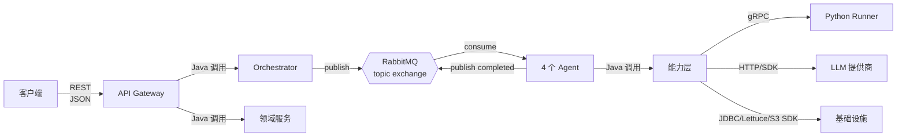
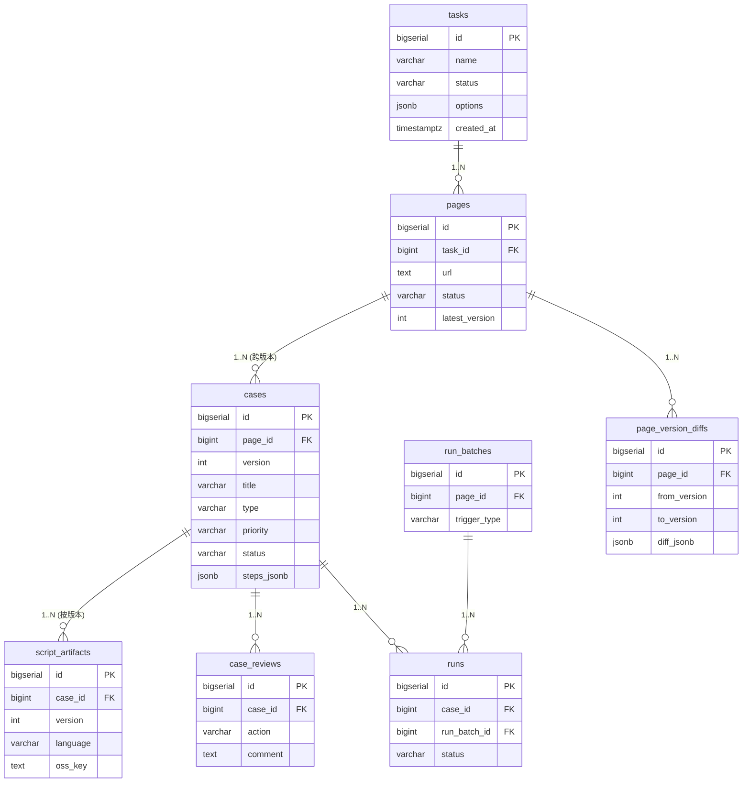
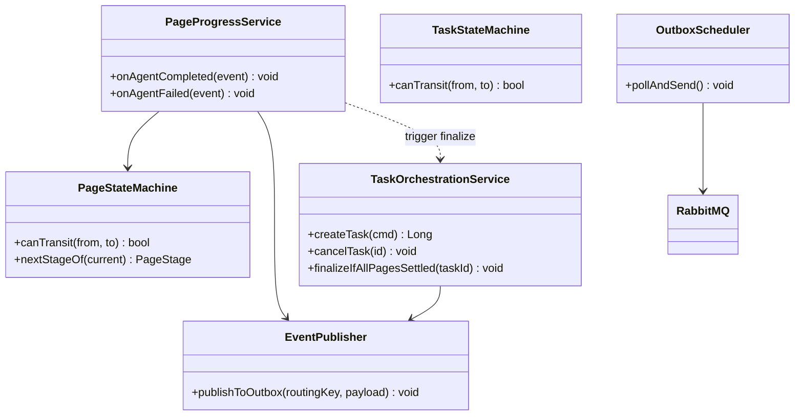
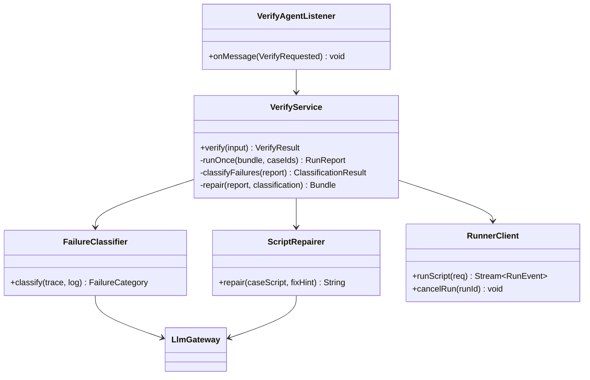

# UI 测试用例生成 Agent —— 详细设计文档（Detailed Design）

> 文档版本：v0.2
> 创建日期：2026-06-29
> 状态：草案
> 上游文档：[high-level-design.md](./high-level-design.md)（HLD v0.1）、[proposal.md](./proposal.md)（需求 v0.2）
> 变更：v0.2 在 v0.1（接口 + 数据库）基础上补齐模块内部设计、核心算法、Prompt 模板、LLM 网关策略、可观测性埋点、部署清单、配置与机密。

---

## 0. 文档说明

### 0.1 目的

将 HLD 中的模块边界、流程、接口路由进一步落到**可实现粒度**，提供后续开发可直接照写的依据：

1. 接口契约（REST、gRPC、MQ、领域服务 Java 接口）—— §1~§5；
2. 数据库设计（含 Flyway DDL）—— §6；
3. 关键算法与协议细节 —— §7、§13；
4. 模块内部设计（包/类/DTO/Entity/VO）—— §11、§12；
5. LLM Prompt 模板与 Gateway 策略 —— §14、§15；
6. 非功能设计：日志、监控、告警 —— §16；
7. 部署、配置与机密 —— §17、§18。

### 0.2 范围

覆盖 **MVP + V1**，包括：

- 任务/页面调度、UI 探查、用例生成、脚本生成、自动验证 + 自修复（MVP）；
- 版本管理、变更检测、人工审核闭环、执行历史（V1）；
- V2 仅以**预留字段/扩展点**形式体现，不展开。

### 0.3 关键约定

| 项 | 约定 |
| --- | --- |
| 主键类型 | **BIGSERIAL**（PostgreSQL 自增 BIGINT） |
| 软删除 | 所有业务表带 `deleted_at TIMESTAMPTZ NULL`；DAO 层统一过滤 |
| 命名风格 | DB 列名、API JSON 字段名一律 **snake_case** |
| 时间类型 | `TIMESTAMPTZ`，统一存 UTC；API 层用 ISO-8601（含时区） |
| 错误响应 | 传统 `{code, message, data}` 信封 |
| 字符集 | DB `UTF8`，Collation `en_US.UTF-8` |
| 日期格式 | `YYYY-MM-DDTHH:mm:ss.SSSZ`（UTC） |
| ID 暴露 | 内部 `BIGINT`，对外 API 序列化为 string（避免 JS 精度） |
| 版本号 | 用例 `version`：单调自增整数（1, 2, 3...） |
| 文档版本 | Schema 通过 Flyway 管理；当前 baseline = `V1__init.sql` |

---

## 1. 系统接口总览



接口类型：

| # | 类型 | 调用方 | 被调方 | 协议 | 章节 |
| --- | --- | --- | --- | --- | --- |
| 1 | 对外 REST | 客户端 | API Gateway | HTTP + JSON | §2 |
| 2 | 内部 RPC | Verifier | Python Runner | gRPC | §3 |
| 3 | 事件消息 | Orchestrator / Agent | Agent / Orchestrator | RabbitMQ AMQP | §4 |
| 4 | 同进程接口 | API / Agent | 领域服务 | Java 方法调用 | §5 |

---

## 2. REST API 设计（对外）

### 2.1 通用约定

#### 2.1.1 基地址与版本

- 基地址：`/api/v1`
- 版本通过 URL 路径体现；break-change 升 `v2`。

#### 2.1.2 统一响应信封

成功：

```json
{
  "code": 0,
  "message": "ok",
  "data": { ... }
}
```

失败：

```json
{
  "code": 40001,
  "message": "task not found",
  "data": null
}
```

#### 2.1.3 错误码段位

| 段位 | 含义 |
| --- | --- |
| `0` | 成功 |
| `40000~40999` | 参数/请求错误（HTTP 4xx） |
| `41000~41999` | 资源未找到 |
| `42000~42999` | 业务规则冲突（状态非法等） |
| `50000~50999` | 服务端内部错误（HTTP 5xx） |
| `51000~51999` | 下游依赖异常（LLM / Runner / 存储） |

详细错误码表见 §2.6。

#### 2.1.4 通用请求头

| 头 | 必选 | 说明 |
| --- | --- | --- |
| `Content-Type: application/json` | 是 | 写请求 |
| `X-Request-Id` | 否 | 客户端追踪 ID；未传则服务端生成 |
| `X-Idempotency-Key` | V1 起支持 | 写操作幂等键 |

### 2.2 任务管理

#### 2.2.1 提交任务  `POST /api/v1/tasks`

**阶段**：MVP

**请求**

```json
{
  "name": "登录页 + 商品页 用例生成",
  "biz_tag": "ecommerce.checkout",
  "urls": [
    "https://example.com/login",
    "https://example.com/product/123"
  ],
  "credential": {
    "login_url": "https://example.com/login",
    "username_selector": "#username",
    "password_selector": "#password",
    "submit_selector": "button[type=submit]",
    "username": "qa_user",
    "password": "******",
    "success_indicator": "url:contains(/home)"
  },
  "prd": {
    "format": "text",
    "content": "本页面用于用户登录..."
  },
  "options": {
    "max_repair_rounds": 3,
    "per_page_timeout_sec": 600,
    "page_concurrency": 1
  }
}
```

| 字段 | 类型 | 必选 | 说明 |
| --- | --- | --- | --- |
| `name` | string(≤128) | 否 | 任务展示名 |
| `biz_tag` | string(≤64) | 否 | 业务标签，用于命名与分类 |
| `urls` | string[] | 是 | 1~50 个 URL，同源 |
| `credential` | object | 否 | 登录凭证；不传则视为公开页 |
| `credential.success_indicator` | string | 否 | 登录成功判定：支持 `url:contains(...)` / `selector:visible(...)` |
| `prd.format` | enum | 否 | MVP 仅 `text`；V1 起新增 `pdf_url` / `docx_url`（先上传到对象存储再传 URL） |
| `prd.content` | string(≤200KB) | 否 | PRD 内容；超长走对象存储引用（V1） |
| `options.max_repair_rounds` | int | 否 | 自修复上限，默认 3 |
| `options.per_page_timeout_sec` | int | 否 | 单页面超时，默认 600 |
| `options.page_concurrency` | int | 否 | 同任务页面并发数；MVP 仅支持 1，V1 起 ≤ 8 |

**响应**：`201 Created`

```json
{
  "code": 0,
  "message": "ok",
  "data": {
    "task_id": "10001",
    "status": "PENDING",
    "created_at": "2026-06-29T03:21:00.000Z"
  }
}
```

#### 2.2.2 查询任务  `GET /api/v1/tasks/{task_id}`

**响应**

```json
{
  "code": 0,
  "data": {
    "task_id": "10001",
    "name": "登录页 + 商品页 用例生成",
    "status": "RUNNING",
    "progress": {
      "total_pages": 2,
      "done_pages": 1,
      "failed_pages": 0
    },
    "pages": [
      {
        "page_id": "20001",
        "url": "https://example.com/login",
        "status": "DONE",
        "current_stage": null,
        "case_count": 12,
        "verify_pass_rate": 0.83
      },
      {
        "page_id": "20002",
        "url": "https://example.com/product/123",
        "status": "VERIFYING",
        "current_stage": "VERIFY",
        "case_count": 18
      }
    ],
    "artifacts": {
      "summary_doc_url": "/api/v1/tasks/10001/doc",
      "summary_doc_oss_key": "task/10001/summary.md"
    },
    "created_at": "2026-06-29T03:21:00.000Z",
    "updated_at": "2026-06-29T03:25:13.000Z",
    "finished_at": null
  }
}
```

任务状态枚举：`PENDING | RUNNING | SUCCEEDED | FAILED | CANCELING | CANCELED`
页面状态枚举：`PENDING | EXPLORING | DESIGNING | WRITING | VERIFYING | DONE | FAILED | CANCELED`

#### 2.2.3 获取用例列表  `GET /api/v1/tasks/{task_id}/cases`

**Query**：`page=1`、`size=50`、`page_id=20001`（可选过滤）、`priority=P0`（可选）

**响应**

```json
{
  "code": 0,
  "data": {
    "total": 30,
    "page": 1,
    "size": 50,
    "items": [
      {
        "case_id": "30001",
        "page_id": "20001",
        "version": 1,
        "title": "正常账号密码登录",
        "priority": "P0",
        "type": "FUNCTIONAL",
        "status": "GENERATED",
        "script_location": "tests/login_test.py::test_login_success",
        "script_artifact_url": "https://minio.local/.../script-bundle.zip",
        "doc_excerpt": "在 #username 输入..."
      }
    ]
  }
}
```

用例类型 `type`：`FUNCTIONAL | BOUNDARY | EXCEPTION`
用例状态 `status`：`GENERATED | VERIFIED | SUSPECT_BUG | REJECTED | MODIFIED | APPROVED`

#### 2.2.4 取消任务  `POST /api/v1/tasks/{task_id}/cancel`

**请求**：空
**响应**：`202 Accepted`，data: `{ "task_id": "10001", "status": "CANCELING" }`
**错误**：`42001 task already finished`

#### 2.2.5 重跑任务脚本  `POST /api/v1/tasks/{task_id}/run`  (V1)

**请求**

```json
{
  "scope": "FAILED_ONLY",     // ALL | FAILED_ONLY | CASE_IDS
  "case_ids": ["30005", "30007"],
  "max_repair_rounds": 1
}
```

**响应**：`202 Accepted`，data: `{ "run_batch_id": "rb_70001" }`

### 2.3 用例管理（V1）

#### 2.3.1 单条用例详情  `GET /api/v1/cases/{case_id}`

**Query**：`with_history=true`（含全部历史版本）

**响应**

```json
{
  "code": 0,
  "data": {
    "case_id": "30001",
    "page_id": "20001",
    "version": 2,
    "title": "正常账号密码登录",
    "priority": "P0",
    "type": "FUNCTIONAL",
    "status": "APPROVED",
    "precondition": "已在登录页",
    "steps": [
      {"order": 1, "action": "fill", "target": "#username", "value": "qa_user"},
      {"order": 2, "action": "fill", "target": "#password", "value": "******"},
      {"order": 3, "action": "click", "target": "button[type=submit]"}
    ],
    "expected": "跳转到 /home 且显示用户名",
    "script_location": "tests/login_test.py::test_login_success",
    "last_run": {
      "run_id": "60001",
      "status": "PASSED",
      "ts": "2026-06-29T03:30:00.000Z"
    },
    "history": [
      {"version": 1, "created_at": "...", "status": "REJECTED"},
      {"version": 2, "created_at": "...", "status": "APPROVED"}
    ]
  }
}
```

#### 2.3.2 人工审核  `POST /api/v1/cases/{case_id}/review`

**请求**

```json
{
  "action": "MODIFY",            // APPROVE | MODIFY | REJECT
  "comment": "断言过严，登录后只需校验 url 变化即可",
  "modified_case": {              // 仅 action=MODIFY 时必填
    "title": "...",
    "steps": [...],
    "expected": "..."
  }
}
```

**响应**：`200`，data: `{ "review_id": "80001", "case_status": "MODIFIED" }`

#### 2.3.3 执行历史  `GET /api/v1/cases/{case_id}/history`

**Query**：`from`、`to`、`status`、`page`、`size`

**响应**：分页 `runs` 列表，每条含 `run_id / status / error_class / duration_ms / trace_url / screenshot_url / ts`。

#### 2.3.4 用例版本差异  `GET /api/v1/cases/{case_id}/diff`

**Query**：`from_version=1&to_version=2`

**响应**

```json
{
  "code": 0,
  "data": {
    "case_id": "30001",
    "from_version": 1,
    "to_version": 2,
    "diff_type": "MODIFIED",   // ADDED | DELETED | MODIFIED
    "field_diffs": [
      {"field": "expected", "from": "...", "to": "..."},
      {"field": "steps[2].target", "from": "#submit", "to": "button[type=submit]"}
    ]
  }
}
```

### 2.4 健康检查

| 路径 | 说明 |
| --- | --- |
| `GET /actuator/health` | Liveness/Readiness |
| `GET /actuator/prometheus` | 指标抓取 |
| `GET /actuator/info` | 版本号、build hash |

### 2.5 限流策略

| 端点 | 限制 |
| --- | --- |
| `POST /tasks` | 10 req/min 全局（MVP 单租户） |
| `POST /tasks/{id}/run` | 20 req/min 全局 |
| `POST /cases/{id}/review` | 100 req/min |
| `GET /*` | 无 |

### 2.6 错误码表

| 错误码 | HTTP | 含义 |
| --- | --- | --- |
| 0 | 200 | 成功 |
| 40001 | 400 | 参数非法 |
| 40002 | 400 | URL 列表为空或超限 |
| 40003 | 400 | 凭证字段缺失 |
| 40004 | 400 | PRD 超长 |
| 41001 | 404 | task 不存在 |
| 41002 | 404 | case 不存在 |
| 41003 | 404 | run 不存在 |
| 42001 | 409 | 任务状态不允许该操作（如已完成任务被取消） |
| 42002 | 409 | 用例已被审核，禁止重复 |
| 50001 | 500 | 内部错误 |
| 51001 | 502 | LLM 调用失败 |
| 51002 | 502 | Python Runner 不可用 |
| 51003 | 502 | 对象存储不可用 |
| 51004 | 502 | MQ 投递失败 |

---

## 3. gRPC 接口设计（Python Runner）

`proto` 放在 `common-proto` 模块，包名 `com.ui_test.runner.v1`。

### 3.1 服务定义

```proto
syntax = "proto3";

package ui_test.runner.v1;

option java_package = "com.ui_test.runner.v1";
option java_multiple_files = true;

service RunnerService {
  // 执行脚本（流式）
  rpc RunScript(RunRequest) returns (stream RunEvent);

  // 取消正在执行的 run
  rpc CancelRun(CancelRequest) returns (Ack);

  // 健康/容量
  rpc HealthCheck(HealthRequest) returns (HealthResponse);
}
```

### 3.2 消息定义

```proto
// ---------- RunScript ----------

message RunRequest {
  string run_id              = 1;   // 幂等键，由 Verifier 生成 UUID
  string task_id             = 2;
  string page_id             = 3;
  string bundle_url          = 4;   // 对象存储预签名 GET URL，指向 script-bundle.zip
  RuntimeProfile profile     = 5;   // 浏览器/分辨率/语言（V2 预留）
  ExecOptions options        = 6;
  repeated string case_ids   = 7;   // 仅执行指定用例；为空 = 全部
}

message RuntimeProfile {
  string browser     = 1;   // chromium | firefox | webkit（MVP 仅 chromium）
  string viewport    = 2;   // 1920x1080
  string locale      = 3;   // zh-CN
  string user_agent  = 4;
}

message ExecOptions {
  int32 per_case_timeout_sec = 1;   // 默认 60
  int32 total_timeout_sec    = 2;   // 默认 1200
  bool  headless             = 3;   // 默认 true
  bool  capture_trace        = 4;   // 默认 true
  bool  capture_video        = 5;   // 默认 false（V2）
  map<string, string> env    = 6;   // 透传环境变量（如 BASE_URL）
}

message RunEvent {
  oneof payload {
    RunStarted   started   = 1;
    CaseProgress progress  = 2;   // 单用例开始/结束
    RunSummary   summary   = 3;   // 终态
    RunError     error     = 4;   // 致命错误（非用例失败）
  }
  string run_id = 10;
  int64  ts_ms  = 11;
}

message RunStarted {
  string runner_node    = 1;     // pod 名
  int32  total_cases    = 2;
}

message CaseProgress {
  string case_id        = 1;
  CaseStatus status     = 2;
  int32  duration_ms    = 3;
  string error_summary  = 4;          // 失败时填
  ArtifactRefs artifacts = 5;
}

enum CaseStatus {
  CASE_STATUS_UNSPECIFIED = 0;
  CASE_RUNNING            = 1;
  CASE_PASSED             = 2;
  CASE_FAILED             = 3;
  CASE_TIMEOUT            = 4;
  CASE_SKIPPED            = 5;
}

message ArtifactRefs {
  string trace_oss_key       = 1;
  string log_oss_key         = 2;
  string screenshot_oss_key  = 3;   // 失败时截图
  string video_oss_key       = 4;
}

message RunSummary {
  int32 total        = 1;
  int32 passed       = 2;
  int32 failed       = 3;
  int32 timeout      = 4;
  int32 skipped      = 5;
  int32 duration_ms  = 6;
  string report_oss_key = 7;   // 完整 pytest report json
}

message RunError {
  string code     = 1;   // BUNDLE_DOWNLOAD_FAILED / PYTEST_BOOT_FAILED / OOM ...
  string message  = 2;
  string detail   = 3;
}

// ---------- CancelRun ----------

message CancelRequest {
  string run_id = 1;
  string reason = 2;
}

message Ack {
  bool   ok      = 1;
  string message = 2;
}

// ---------- HealthCheck ----------

message HealthRequest {}

message HealthResponse {
  bool   alive             = 1;
  int32  running_count     = 2;
  int32  max_concurrency   = 3;
  string playwright_version = 4;
  string runner_version     = 5;
}
```

### 3.3 调用约束

| 项 | 值 |
| --- | --- |
| 端口 | 50051 |
| TLS | 内网明文（V1 起开启 mTLS） |
| 调用超时 | 由 `ExecOptions.total_timeout_sec` 决定，默认 1200s |
| 流式心跳 | 每 30s 一条 `CaseProgress` 或心跳事件，无则视为断线 |
| 幂等 | 相同 `run_id` 重入时，Runner 返回缓存的 `RunSummary` 并立即结束流 |
| 重试 | gRPC 通道层重连最多 3 次；业务层不重试同一 `run_id` |

---

## 4. RabbitMQ 消息设计

### 4.1 拓扑

```
┌─────────────────────────────────────────────────────────────┐
│  Exchange: ui-test.events  (type=topic, durable=true)       │
└─────────────────────────────────────────────────────────────┘
        │ routing_key = page.<stage>.<event>
        │
        ▼
┌──────────────────────────────┬──────────────────────────────┐
│ Queue                        │ Binding (routing key)        │
├──────────────────────────────┼──────────────────────────────┤
│ q.explorer.requested         │ page.explore.requested       │
│ q.designer.requested         │ page.design.requested        │
│ q.writer.requested           │ page.write.requested         │
│ q.verifier.requested         │ page.verify.requested        │
│ q.orchestrator.completed     │ page.*.completed             │
│ q.orchestrator.failed        │ page.*.failed                │
└──────────────────────────────┴──────────────────────────────┘
        │
        ▼  消费失败 N 次后
┌─────────────────────────────────────────────────────────────┐
│  Exchange: ui-test.dlx  (type=topic)                        │
│  Queue:    q.dlq.<orig-queue-name>                          │
└─────────────────────────────────────────────────────────────┘
```

#### 4.1.1 队列属性

| 属性 | 值 |
| --- | --- |
| `durable` | `true` |
| `auto-delete` | `false` |
| `x-dead-letter-exchange` | `ui-test.dlx` |
| `x-dead-letter-routing-key` | 原 routing key |
| `x-max-priority` | 10（V1 起，MVP 不启用） |
| `x-message-ttl` | 24h（避免堆积过久消息） |

### 4.2 消息信封

所有消息共享统一信封：

```json
{
  "event_id": "uuid-v4",
  "event_type": "page.explore.requested",
  "event_version": 1,
  "occurred_at": "2026-06-29T03:21:00.000Z",
  "trace_id": "abc123",
  "task_id": "10001",
  "page_id": "20001",
  "page_version": 1,
  "payload": { ... }
}
```

| 字段 | 类型 | 说明 |
| --- | --- | --- |
| `event_id` | UUID | 全局唯一，幂等键 |
| `event_type` | string | 与 routing_key 一致 |
| `event_version` | int | payload schema 版本 |
| `occurred_at` | ISO-8601 | 事件发生时间 |
| `trace_id` | string | 链路 ID，贯穿所有消息与日志 |
| `task_id`/`page_id` | string | 业务上下文 |
| `page_version` | int | 用例版本号；自修复或重跑时递增 |
| `payload` | object | 事件特定数据 |

### 4.3 消息列表与 payload

#### 4.3.1 `page.explore.requested`  → UI Explorer

```json
{
  "payload": {
    "url": "https://example.com/login",
    "credential_ref": "cred:10001:a8f2c1",
    "prd_ref": "oss://prd/task-10001.txt",
    "biz_tag": "ecommerce.checkout",
    "options": {
      "viewport": "1920x1080",
      "wait_after_load_ms": 1500,
      "max_states_to_probe": 6
    }
  }
}
```

#### 4.3.2 `page.explore.completed`  → Orchestrator

```json
{
  "payload": {
    "ui_snapshot_ref": "oss://ui-snapshots/10001/20001/v1.json",
    "screenshot_refs": [
      "oss://screenshots/10001/20001/full.png",
      "oss://screenshots/10001/20001/header.png"
    ],
    "storage_state_ref": "oss://storage-state/10001/20001.json",
    "element_count": 47,
    "duration_ms": 12400
  }
}
```

#### 4.3.3 `page.design.requested`  → Case Designer

```json
{
  "payload": {
    "ui_snapshot_ref": "oss://ui-snapshots/10001/20001/v1.json",
    "prd_ref": "oss://prd/task-10001.txt",
    "biz_tag": "ecommerce.checkout",
    "feedback_ref": "oss://feedback/page-hash-xxx.json"
  }
}
```

#### 4.3.4 `page.design.completed`  → Orchestrator

```json
{
  "payload": {
    "cases_ref": "oss://cases/10001/20001/v1.json",
    "case_ids": ["30001", "30002", "..."],
    "version": 1,
    "stats": {
      "functional": 8,
      "boundary": 4,
      "exception": 6
    }
  }
}
```

#### 4.3.5 `page.write.requested`  → Script Writer

```json
{
  "payload": {
    "cases_ref": "oss://cases/10001/20001/v1.json",
    "ui_snapshot_ref": "oss://ui-snapshots/10001/20001/v1.json",
    "storage_state_ref": "oss://storage-state/10001/20001.json"
  }
}
```

#### 4.3.6 `page.write.completed`  → Orchestrator

```json
{
  "payload": {
    "script_bundle_ref": "oss://scripts/10001/20001/v1/bundle.zip",
    "doc_ref": "oss://docs/10001/20001/v1.md",
    "file_count": 3,
    "bundle_size_bytes": 18432
  }
}
```

#### 4.3.7 `page.verify.requested`  → Verifier

```json
{
  "payload": {
    "script_bundle_ref": "oss://scripts/10001/20001/v1/bundle.zip",
    "cases_ref": "oss://cases/10001/20001/v1.json",
    "max_repair_rounds": 3
  }
}
```

#### 4.3.8 `page.verify.completed`  → Orchestrator

```json
{
  "payload": {
    "report_ref": "oss://reports/10001/20001/v1/report.json",
    "final_script_bundle_ref": "oss://scripts/10001/20001/v1-fixed/bundle.zip",
    "stats": {
      "total": 18,
      "passed": 15,
      "failed": 0,
      "suspect_bugs": 3,
      "repair_rounds_used": 2
    },
    "suspect_bug_case_ids": ["30007", "30011", "30015"]
  }
}
```

#### 4.3.9 `page.*.failed`  → Orchestrator

```json
{
  "payload": {
    "stage": "EXPLORE",                      // EXPLORE | DESIGN | WRITE | VERIFY
    "error_code": "EXPLORE_LOGIN_TIMEOUT",
    "message": "登录超时，未检测到 success_indicator",
    "retryable": false,
    "retry_count": 2
  }
}
```

### 4.4 消费规约

| 项 | 规约 |
| --- | --- |
| ACK 模式 | 手动 ack；处理成功后 `basic.ack`；不可恢复异常 `basic.nack(requeue=false)` 进 DLQ |
| 预取数 (prefetch) | 每消费者 8；Agent 副本数 × 8 = 该队列总并发上限 |
| 重试次数 | 同一 `event_id` 业务侧重试 ≤ 2 次；超过转 DLQ |
| 幂等保证 | 消费者用 Redis SETNX `mq:processed:{event_id}` TTL=24h 防重复 |
| 顺序保证 | 同一 `page_id` 内事件由 Orchestrator 状态机保序；MQ 不保证 |

---

## 5. 领域服务 Java 接口

包路径：`com.uitest.domain.*`。所有接口声明在 `domain-service` 模块；实现为 Spring `@Service`。

### 5.1 TaskService

```java
package com.uitest.domain.task;

public interface TaskService {

    /**
     * 创建任务（含展开 pages 行）。事务内完成。
     * @return 新建任务的 id
     */
    Long createTask(CreateTaskCommand cmd);

    Task getById(Long taskId);

    Optional<Task> findById(Long taskId);

    /**
     * 推进 task 状态（带前置校验）。
     * @throws IllegalStateTransitionException 当 from 状态不允许进入 to
     */
    void transitTaskStatus(Long taskId, TaskStatus expectFrom, TaskStatus to);

    void transitPageStatus(Long pageId, PageStatus expectFrom, PageStatus to);

    void markPageStage(Long pageId, PageStage stage);

    /** 列表查询：分页 + 过滤（状态、时间窗、name like） */
    Page<TaskSummary> listTasks(TaskQuery query, Pageable pageable);

    List<PageRow> listPages(Long taskId);

    /** 任务取消请求：仅置 CANCELING 标志，不直接结束 */
    void requestCancel(Long taskId);

    /** Orchestrator 在所有 page 收敛后调用，将任务最终化 */
    void finalizeTask(Long taskId, TaskFinalizeOutcome outcome);
}
```

```java
public record CreateTaskCommand(
    String name,
    String bizTag,
    List<String> urls,
    String credentialRef,    // 已写入 Vault 后的引用
    String prdRef,           // 已写入 OSS 后的引用，或 null
    TaskOptions options
) {}

public record TaskOptions(
    int maxRepairRounds,
    int perPageTimeoutSec,
    int pageConcurrency
) {}

public enum TaskStatus { PENDING, RUNNING, SUCCEEDED, FAILED, CANCELING, CANCELED }
public enum PageStatus { PENDING, EXPLORING, DESIGNING, WRITING, VERIFYING, DONE, FAILED, CANCELED }
public enum PageStage  { EXPLORE, DESIGN, WRITE, VERIFY }
```

### 5.2 CaseService

```java
package com.uitest.domain.cases;

public interface CaseService {

    /**
     * 批量写入新生成的用例；自动分配 version：
     *   - 同 page 下若存在历史 case，version = max(version) + 1
     *   - 否则 version = 1
     * 同一 batch 内的所有 case 共享同一 version。
     */
    List<Long> appendCases(Long pageId, List<NewCase> cases);

    Case getById(Long caseId);

    /** 取某 page 的最新版本 cases */
    List<Case> listLatest(Long pageId);

    /** 取某 page 某 version 的 cases */
    List<Case> listByVersion(Long pageId, int version);

    /** 取某 page 的所有版本号（升序） */
    List<Integer> listVersions(Long pageId);

    /** 更新用例状态（由 Verifier / Review 调用） */
    void updateStatus(Long caseId, CaseStatus newStatus);

    /** 替换脚本位置（Writer / Verifier 调用） */
    void updateScriptLocation(Long caseId, String scriptLocation, String scriptArtifactId);

    /** 持久化一个 case 修改版本（来自 Review.MODIFY） */
    Long createModifiedVersion(Long fromCaseId, NewCase modified);
}
```

```java
public record NewCase(
    String title,
    CaseType type,           // FUNCTIONAL | BOUNDARY | EXCEPTION
    CasePriority priority,   // P0 | P1 | P2
    String precondition,
    JsonNode stepsJson,      // 见 §6.6 步骤 JSON 协议
    String expected,
    String scriptLocation,   // file.py::test_name；可空，Writer 后填
    String tags              // 逗号分隔
) {}

public enum CaseStatus { GENERATED, VERIFIED, SUSPECT_BUG, REJECTED, MODIFIED, APPROVED }
public enum CaseType { FUNCTIONAL, BOUNDARY, EXCEPTION }
public enum CasePriority { P0, P1, P2 }
```

### 5.3 VersionDiffService (V1)

```java
package com.uitest.domain.cases;

public interface VersionDiffService {

    /** 计算两版本之间的差异，结果同时落 page_version_diffs 表 */
    PageDiff diff(Long pageId, int fromVersion, int toVersion);

    /** 取指定 page 最近两版本的差异 */
    Optional<PageDiff> latestDiff(Long pageId);

    /** 某条 case 的版本间字段级 diff */
    CaseDiff diffCase(Long caseId, int fromVersion, int toVersion);
}

public record PageDiff(
    Long pageId,
    int fromVersion,
    int toVersion,
    List<Long> addedCaseIds,
    List<Long> deletedCaseIds,
    List<Long> modifiedCaseIds
) {}

public record CaseDiff(Long caseId, int fromVersion, int toVersion, List<FieldDiff> fields) {}
public record FieldDiff(String path, JsonNode from, JsonNode to) {}
```

### 5.4 ReviewService (V1)

```java
package com.uitest.domain.review;

public interface ReviewService {

    Long submitReview(SubmitReviewCommand cmd);

    Optional<Review> getById(Long reviewId);

    Page<Review> listByCase(Long caseId, Pageable pageable);

    /**
     * 给 Designer 反馈采样：返回最近 N 条 REJECT/MODIFY 样本（按 page_hash 维度，
     * 用于"该类页面上 QA 倾向拒绝/修改哪些用例"的负样本注入）。
     */
    List<FeedbackSample> sampleFeedback(String pageHash, int limit);
}

public record SubmitReviewCommand(
    Long caseId,
    ReviewAction action,
    String comment,
    NewCase modifiedCase     // action=MODIFY 时必填
) {}

public enum ReviewAction { APPROVE, MODIFY, REJECT }

public record FeedbackSample(
    Long caseId,
    ReviewAction action,
    String comment,
    String originalTitle,
    JsonNode originalStepsJson,
    JsonNode modifiedStepsJson   // MODIFY 时
) {}
```

### 5.5 RunHistoryService (V1)

```java
package com.uitest.domain.run;

public interface RunHistoryService {

    /** Verifier 调用：开启一次 run */
    Long beginRun(BeginRunCommand cmd);

    /** Runner 每条 CaseProgress 调用：写一条 case 级记录 */
    void recordCaseRun(RecordCaseRunCommand cmd);

    /** Run 结束总结写入 */
    void finalizeRun(Long runBatchId, RunBatchSummary summary);

    Page<RunRow> listByCase(Long caseId, RunQuery query, Pageable pageable);

    Optional<RunRow> getLastRun(Long caseId);
}

public record BeginRunCommand(
    Long pageId,
    Integer version,
    String triggerType,      // AUTO_VERIFY | MANUAL_RERUN | REPAIR
    String triggeredBy
) {}

public record RecordCaseRunCommand(
    Long runBatchId,
    Long caseId,
    RunStatus status,
    String errorClass,       // SELECTOR | TIMING | ASSERT | REAL_BUG | null
    int durationMs,
    String traceRef,
    String logRef,
    String screenshotRef
) {}

public enum RunStatus { RUNNING, PASSED, FAILED, TIMEOUT, SKIPPED }
```

### 5.6 共用对象

```java
public class IllegalStateTransitionException extends RuntimeException { ... }
public class ResourceNotFoundException extends RuntimeException { ... }
public class ConcurrentModificationException extends RuntimeException { ... }
```

事务规约：

- 所有 `@Transactional` 默认 `REQUIRED`、`READ_COMMITTED`；
- 跨服务调用 **禁止嵌套事务**（如 Designer 在写完 case 后再调 VersionDiff，必须分两个事务）；
- 状态变更使用乐观锁（见 §6 各表 `version` 列）。

---

## 6. 数据库设计

### 6.1 概览

| # | 表 | 用途 | 阶段 |
| --- | --- | --- | --- |
| T1 | `tasks` | 任务主表 | MVP |
| T2 | `pages` | 任务内页面 | MVP |
| T3 | `cases` | 用例主表（含所有版本） | MVP |
| T4 | `script_artifacts` | 脚本/文档产物索引 | MVP |
| T5 | `mq_processed_events` | 消费幂等表（兜底，主路径走 Redis） | MVP |
| T6 | `case_reviews` | 人工审核记录 | V1 |
| T7 | `runs` | 单用例执行记录 | V1 |
| T8 | `run_batches` | 一次完整 RunScript 的批次 | V1 |
| T9 | `page_version_diffs` | 页面版本差异摘要 | V1 |
| T10 | `feedback_samples` | Designer 反馈样本物化视图（可选） | V1 |

### 6.2 ER 图



### 6.3 完整 DDL（Flyway `V1__init.sql`）

```sql
-- =========================================================
-- File: V1__init.sql
-- DB:   PostgreSQL 15+
-- Note: 全量 snake_case；BIGSERIAL 主键；TIMESTAMPTZ；软删除
-- =========================================================

CREATE EXTENSION IF NOT EXISTS pg_trgm;     -- 用于 url/title 模糊检索（V1+）

-- ---------- T1. tasks ----------

CREATE TABLE tasks (
    id              BIGSERIAL    PRIMARY KEY,
    name            VARCHAR(128),
    biz_tag         VARCHAR(64),
    status          VARCHAR(16)  NOT NULL,    -- PENDING/RUNNING/SUCCEEDED/FAILED/CANCELING/CANCELED
    options_jsonb   JSONB        NOT NULL DEFAULT '{}'::jsonb,
    prd_ref         TEXT,                       -- OSS key or null
    credential_ref  VARCHAR(128),               -- vault ref or null
    urls_jsonb      JSONB        NOT NULL,      -- 原始 URL 清单，便于回查
    total_pages     INT          NOT NULL DEFAULT 0,
    done_pages      INT          NOT NULL DEFAULT 0,
    failed_pages    INT          NOT NULL DEFAULT 0,
    summary_jsonb   JSONB,                      -- 终态摘要
    row_version     INT          NOT NULL DEFAULT 0,   -- 乐观锁
    created_at      TIMESTAMPTZ  NOT NULL DEFAULT now(),
    updated_at      TIMESTAMPTZ  NOT NULL DEFAULT now(),
    finished_at     TIMESTAMPTZ,
    deleted_at      TIMESTAMPTZ                 -- 软删除
);

CREATE INDEX idx_tasks_status        ON tasks(status) WHERE deleted_at IS NULL;
CREATE INDEX idx_tasks_created_at    ON tasks(created_at DESC) WHERE deleted_at IS NULL;
CREATE INDEX idx_tasks_biz_tag       ON tasks(biz_tag) WHERE deleted_at IS NULL;

-- ---------- T2. pages ----------

CREATE TABLE pages (
    id                BIGSERIAL   PRIMARY KEY,
    task_id           BIGINT      NOT NULL REFERENCES tasks(id),
    url               TEXT        NOT NULL,
    url_hash          CHAR(64)    NOT NULL,    -- sha256(url)，便于跨任务关联同一 URL
    status            VARCHAR(16) NOT NULL,    -- 见 PageStatus 枚举
    current_stage     VARCHAR(16),             -- EXPLORE / DESIGN / WRITE / VERIFY
    latest_version    INT         NOT NULL DEFAULT 0,
    case_count        INT         NOT NULL DEFAULT 0,
    verify_pass_rate  NUMERIC(5,4),            -- 0.0000~1.0000
    last_error_code   VARCHAR(64),
    last_error_msg    TEXT,
    ui_snapshot_ref   TEXT,                    -- OSS key
    storage_state_ref TEXT,                    -- OSS key（登录态）
    row_version       INT         NOT NULL DEFAULT 0,
    created_at        TIMESTAMPTZ NOT NULL DEFAULT now(),
    updated_at        TIMESTAMPTZ NOT NULL DEFAULT now(),
    finished_at       TIMESTAMPTZ,
    deleted_at        TIMESTAMPTZ
);

CREATE INDEX idx_pages_task_id       ON pages(task_id) WHERE deleted_at IS NULL;
CREATE INDEX idx_pages_status        ON pages(status) WHERE deleted_at IS NULL;
CREATE INDEX idx_pages_url_hash      ON pages(url_hash) WHERE deleted_at IS NULL;

-- ---------- T3. cases ----------

CREATE TABLE cases (
    id              BIGSERIAL    PRIMARY KEY,
    page_id         BIGINT       NOT NULL REFERENCES pages(id),
    version         INT          NOT NULL,                 -- 自然 case 版本号
    parent_case_id  BIGINT       REFERENCES cases(id),     -- 来自 MODIFY 时指向旧版
    title           VARCHAR(256) NOT NULL,
    type            VARCHAR(16)  NOT NULL,                 -- FUNCTIONAL/BOUNDARY/EXCEPTION
    priority        VARCHAR(4)   NOT NULL,                 -- P0/P1/P2
    status          VARCHAR(16)  NOT NULL,                 -- GENERATED/.../APPROVED
    precondition    TEXT,
    steps_jsonb     JSONB        NOT NULL,                 -- 见 §6.6 协议
    expected        TEXT,
    tags            VARCHAR(256),
    script_location VARCHAR(256),                          -- file.py::test_name
    script_artifact_id BIGINT,                             -- 弱关联 script_artifacts.id
    business_intent TEXT,                                  -- 业务语义增强后的描述
    row_version     INT          NOT NULL DEFAULT 0,
    created_at      TIMESTAMPTZ  NOT NULL DEFAULT now(),
    updated_at      TIMESTAMPTZ  NOT NULL DEFAULT now(),
    deleted_at      TIMESTAMPTZ,
    CONSTRAINT chk_cases_priority CHECK (priority IN ('P0','P1','P2')),
    CONSTRAINT chk_cases_type     CHECK (type IN ('FUNCTIONAL','BOUNDARY','EXCEPTION'))
);

CREATE INDEX idx_cases_page_id_version ON cases(page_id, version) WHERE deleted_at IS NULL;
CREATE INDEX idx_cases_status          ON cases(status) WHERE deleted_at IS NULL;
CREATE INDEX idx_cases_parent          ON cases(parent_case_id);
CREATE INDEX idx_cases_steps_gin       ON cases USING GIN (steps_jsonb jsonb_path_ops);

-- ---------- T4. script_artifacts ----------

CREATE TABLE script_artifacts (
    id           BIGSERIAL    PRIMARY KEY,
    case_id      BIGINT       NOT NULL REFERENCES cases(id),
    page_id      BIGINT       NOT NULL REFERENCES pages(id),
    version      INT          NOT NULL,
    language     VARCHAR(16)  NOT NULL DEFAULT 'PYTHON',   -- V2 预留
    oss_key      TEXT         NOT NULL,                    -- 单脚本文件或 bundle 内路径
    bundle_key   TEXT,                                     -- 所属 bundle 的 OSS key
    file_path    VARCHAR(256),                             -- bundle 内相对路径
    test_name    VARCHAR(128),                             -- pytest 函数名
    checksum     CHAR(64),                                 -- sha256
    size_bytes   BIGINT,
    created_at   TIMESTAMPTZ  NOT NULL DEFAULT now(),
    deleted_at   TIMESTAMPTZ
);

CREATE INDEX idx_scripts_case   ON script_artifacts(case_id, version) WHERE deleted_at IS NULL;
CREATE INDEX idx_scripts_page   ON script_artifacts(page_id, version) WHERE deleted_at IS NULL;

-- ---------- T5. mq_processed_events ----------

CREATE TABLE mq_processed_events (
    event_id     UUID         PRIMARY KEY,
    event_type   VARCHAR(64)  NOT NULL,
    consumer     VARCHAR(64)  NOT NULL,
    task_id      BIGINT,
    page_id      BIGINT,
    processed_at TIMESTAMPTZ  NOT NULL DEFAULT now(),
    result       VARCHAR(16)  NOT NULL,    -- OK | FAILED | SKIPPED
    error_msg    TEXT
);

CREATE INDEX idx_mq_processed_created ON mq_processed_events(processed_at);

-- ---------- T6. case_reviews (V1) ----------

CREATE TABLE case_reviews (
    id              BIGSERIAL    PRIMARY KEY,
    case_id         BIGINT       NOT NULL REFERENCES cases(id),
    case_version    INT          NOT NULL,
    reviewer        VARCHAR(64)  NOT NULL DEFAULT 'anonymous',
    action          VARCHAR(16)  NOT NULL,    -- APPROVE/MODIFY/REJECT
    comment         TEXT,
    modified_jsonb  JSONB,                    -- action=MODIFY 时的修改快照
    new_case_id     BIGINT REFERENCES cases(id),  -- MODIFY 产生的新 case
    created_at      TIMESTAMPTZ  NOT NULL DEFAULT now(),
    deleted_at      TIMESTAMPTZ,
    CONSTRAINT chk_reviews_action CHECK (action IN ('APPROVE','MODIFY','REJECT'))
);

CREATE INDEX idx_reviews_case_id ON case_reviews(case_id) WHERE deleted_at IS NULL;
CREATE INDEX idx_reviews_action  ON case_reviews(action) WHERE deleted_at IS NULL;

-- ---------- T7/T8. run_batches & runs (V1) ----------

CREATE TABLE run_batches (
    id             BIGSERIAL    PRIMARY KEY,
    page_id        BIGINT       NOT NULL REFERENCES pages(id),
    version        INT          NOT NULL,
    trigger_type   VARCHAR(16)  NOT NULL,    -- AUTO_VERIFY / MANUAL_RERUN / REPAIR
    triggered_by   VARCHAR(64),
    parent_batch_id BIGINT REFERENCES run_batches(id),   -- 自修复时指向上一轮
    runner_node    VARCHAR(64),
    status         VARCHAR(16)  NOT NULL,    -- RUNNING / FINISHED / FAILED / CANCELED
    total_cases    INT          NOT NULL DEFAULT 0,
    passed         INT          NOT NULL DEFAULT 0,
    failed         INT          NOT NULL DEFAULT 0,
    timeout_count  INT          NOT NULL DEFAULT 0,
    skipped        INT          NOT NULL DEFAULT 0,
    duration_ms    INT,
    report_ref     TEXT,
    created_at     TIMESTAMPTZ  NOT NULL DEFAULT now(),
    finished_at    TIMESTAMPTZ,
    deleted_at     TIMESTAMPTZ
);

CREATE INDEX idx_run_batches_page ON run_batches(page_id, version) WHERE deleted_at IS NULL;

CREATE TABLE runs (
    id               BIGSERIAL    PRIMARY KEY,
    run_batch_id     BIGINT       NOT NULL REFERENCES run_batches(id),
    case_id          BIGINT       NOT NULL REFERENCES cases(id),
    case_version     INT          NOT NULL,
    status           VARCHAR(16)  NOT NULL,    -- RUNNING/PASSED/FAILED/TIMEOUT/SKIPPED
    error_class      VARCHAR(16),              -- SELECTOR/TIMING/ASSERT/REAL_BUG/NULL
    error_summary    TEXT,
    duration_ms      INT,
    trace_ref        TEXT,
    log_ref          TEXT,
    screenshot_ref   TEXT,
    started_at       TIMESTAMPTZ  NOT NULL DEFAULT now(),
    finished_at      TIMESTAMPTZ,
    deleted_at       TIMESTAMPTZ,
    CONSTRAINT chk_runs_error_class CHECK (
      error_class IS NULL OR error_class IN ('SELECTOR','TIMING','ASSERT','REAL_BUG')
    )
);

CREATE INDEX idx_runs_case_id_started ON runs(case_id, started_at DESC) WHERE deleted_at IS NULL;
CREATE INDEX idx_runs_batch           ON runs(run_batch_id) WHERE deleted_at IS NULL;
CREATE INDEX idx_runs_status          ON runs(status) WHERE deleted_at IS NULL;

-- ---------- T9. page_version_diffs (V1) ----------

CREATE TABLE page_version_diffs (
    id            BIGSERIAL    PRIMARY KEY,
    page_id       BIGINT       NOT NULL REFERENCES pages(id),
    from_version  INT          NOT NULL,
    to_version    INT          NOT NULL,
    added_count   INT          NOT NULL DEFAULT 0,
    deleted_count INT          NOT NULL DEFAULT 0,
    modified_count INT         NOT NULL DEFAULT 0,
    diff_jsonb    JSONB        NOT NULL,    -- 见 §6.7
    created_at    TIMESTAMPTZ  NOT NULL DEFAULT now(),
    deleted_at    TIMESTAMPTZ,
    CONSTRAINT uk_diff_page_versions UNIQUE (page_id, from_version, to_version)
);

CREATE INDEX idx_diffs_page ON page_version_diffs(page_id) WHERE deleted_at IS NULL;

-- ---------- T10. feedback_samples (V1, 可选实体表) ----------

CREATE TABLE feedback_samples (
    id           BIGSERIAL    PRIMARY KEY,
    page_hash    CHAR(64)     NOT NULL,    -- url_hash 或 dom 结构 hash
    review_id    BIGINT       NOT NULL REFERENCES case_reviews(id),
    case_id      BIGINT       NOT NULL REFERENCES cases(id),
    action       VARCHAR(16)  NOT NULL,
    snapshot     JSONB        NOT NULL,    -- {original, modified?, comment}
    created_at   TIMESTAMPTZ  NOT NULL DEFAULT now(),
    deleted_at   TIMESTAMPTZ
);

CREATE INDEX idx_feedback_page_hash ON feedback_samples(page_hash, created_at DESC) WHERE deleted_at IS NULL;
```

### 6.4 状态机约束（DB 触发器或应用层）

在应用层用枚举 + check 即可，**不写触发器**（避免数据库与业务耦合过紧）。状态转换合法集合写死在 `TaskService.transitTaskStatus`：

```
Task:
  PENDING    → RUNNING | CANCELING | FAILED
  RUNNING    → SUCCEEDED | FAILED | CANCELING
  CANCELING  → CANCELED
  SUCCEEDED, FAILED, CANCELED — 终态

Page:
  PENDING    → EXPLORING | CANCELED
  EXPLORING  → DESIGNING | FAILED | CANCELED
  DESIGNING  → WRITING   | FAILED | CANCELED
  WRITING    → VERIFYING | FAILED | CANCELED
  VERIFYING  → DONE      | FAILED | CANCELED
  DONE, FAILED, CANCELED — 终态
```

### 6.5 软删除统一约束

- 所有 `SELECT` 查询 DAO 层强制注入 `WHERE deleted_at IS NULL`；
- 部分索引采用 `WHERE deleted_at IS NULL`（节省空间，避免删除数据膨胀索引）；
- 物理删除仅用于定时清理脚本（保留窗口：90 天），独立 Job 完成。

### 6.6 `cases.steps_jsonb` 步骤协议

```json
{
  "schema_version": 1,
  "steps": [
    {
      "order": 1,
      "action": "navigate",
      "target": "https://example.com/login",
      "value": null,
      "wait": {"type": "load_state", "value": "networkidle"},
      "assert": null
    },
    {
      "order": 2,
      "action": "fill",
      "target": {
        "primary": "role=textbox[name='Username']",
        "fallback": ["#username", "input[name=username]"]
      },
      "value": "qa_user"
    },
    {
      "order": 3,
      "action": "click",
      "target": {"primary": "button[type=submit]"},
      "wait": {"type": "url", "value": "/home"}
    }
  ]
}
```

支持的 `action` 枚举：`navigate / fill / click / hover / select / check / uncheck / upload / press / wait / screenshot / assert`。

### 6.7 `page_version_diffs.diff_jsonb` 协议

```json
{
  "schema_version": 1,
  "added":    [{"case_id": 30021, "title": "..."}],
  "deleted":  [{"case_id": 30011, "title": "..."}],
  "modified": [
    {
      "case_id": 30005,
      "field_diffs": [
        {"path": "expected", "from": "...", "to": "..."},
        {"path": "steps[2].target.primary", "from": "#submit", "to": "button[type=submit]"}
      ]
    }
  ]
}
```

### 6.8 索引策略与查询样本

| 高频查询 | 命中索引 |
| --- | --- |
| 列表查询任务（按时间/状态） | `idx_tasks_created_at` / `idx_tasks_status` |
| 任务详情 → 取所有 page | `idx_pages_task_id` |
| 同 URL 历史 page（跨任务） | `idx_pages_url_hash` |
| 取某 page 最新版本 case | `idx_cases_page_id_version` |
| 用例执行历史时间线 | `idx_runs_case_id_started` |
| 同 page_hash 的反馈采样 | `idx_feedback_page_hash` |
| Designer 检索 steps 中包含某动作 | `idx_cases_steps_gin` (GIN) |

### 6.9 数据保留与清理

| 数据 | 保留 | 清理方式 |
| --- | --- | --- |
| `tasks` SUCCEEDED/FAILED | 180 天 | 软删除 + 90 天后物理删除 |
| `cases` 已 APPROVED | 永久 | — |
| `runs` | 90 天 | 软删除 |
| `mq_processed_events` | 7 天 | 物理删除（清空表） |
| 软删除数据 | 90 天后清扫 | 定时 Job |

---

## 7. 关键算法与协议细节

### 7.1 用例 ID 与版本号分配

- `cases.version` 在 `(page_id)` 范围内取 `max(version) + 1`；
- 分配通过 `pages.latest_version` 字段乐观加锁实现：

```sql
UPDATE pages
SET latest_version = latest_version + 1,
    row_version    = row_version + 1
WHERE id = ? AND row_version = ?
RETURNING latest_version;
```

新 batch 内的所有 case 使用同一 `latest_version` 值。

### 7.2 自修复循环（Verifier 内部）

```
输入: page_id, version, max_repair_rounds
state: round = 0, failing_case_ids = []

repeat:
    report = call_runner(bundle_url, case_ids=failing_case_ids 或全量)
    failing = report.failed + report.timeout
    if failing.empty: break
    if round >= max_repair_rounds: break

    classify_results = parallel:
        for f in failing:
            cat = LLM.classify(trace=f.trace, log=f.log)   # SELECTOR/TIMING/ASSERT/REAL_BUG

    real_bugs = filter(cat == REAL_BUG)
    repairable = failing - real_bugs
    if repairable.empty: break

    for c in repairable:
        new_script = LLM.rewrite(case=c, fix_hint=cat.hint)
        update bundle with new_script
    upload new bundle as v{version}-r{round+1}
    failing_case_ids = [c.id for c in repairable]
    round += 1

return final_report(passed=*, suspect_bugs=real_bugs, repair_rounds_used=round)
```

失败分类启发式信号（喂给 LLM 的特征摘要）：

| 信号 | 推断分类 |
| --- | --- |
| `TimeoutError: locator.*` + DOM 中无匹配 | SELECTOR |
| `TimeoutError: waiting for navigation/networkidle` + DOM 有目标元素 | TIMING |
| `AssertionError` + 实际值与预期值都"看起来合理" | ASSERT |
| `AssertionError` + 预期值合理、实际值明显错误（如 404/异常文本） | REAL_BUG |

### 7.3 消息消费幂等

```java
// 双层防重：Redis 主路径 + DB 兜底
boolean firstTime = redis.setIfAbsent("mq:processed:" + eventId, "1", 24, HOURS);
if (!firstTime) { ack(); return; }

try {
    handleBusiness(event);
    db.insert(mq_processed_events, eventId, OK);   // DB 兜底
    ack();
} catch (Throwable t) {
    redis.delete("mq:processed:" + eventId);       // 撤销标记
    if (retryCount < 2) { nackRequeue(); }
    else { nackToDlq(); db.insert(mq_processed_events, eventId, FAILED); }
}
```

### 7.4 任务取消传播

```
1. POST /tasks/{id}/cancel
   → TaskService.requestCancel(id)
   → DB: tasks.status = CANCELING
   → Redis: SET task:{id}:cancel "1" EX 3600

2. 每个 Agent 在处理消息前与每个步骤前检查 cancel flag：
   if (redis.get("task:" + taskId + ":cancel") != null) {
       publish page.*.failed (cancelled)
       ack and return
   }

3. Verifier 检测到 cancel：
   runnerClient.cancelRun(runId)

4. Orchestrator 监听 page 状态：所有 page 进入终态 → tasks.status = CANCELED
```

### 7.5 状态机与消息双写一致性（事务消息）

Orchestrator 推进 page 状态时，**先 DB 提交、再发 MQ**，但 MQ 发布失败需补偿：

```
@Transactional
void onAgentCompleted(event):
    Page p = pageRepo.findById(event.pageId)
    if (!validTransition(p.status, NEXT)) return       // 幂等
    p.status = NEXT
    p.row_version++
    pageRepo.save(p)
    outboxRepo.save(OutboxEvent(next_event))           // 同事务写入 outbox

// 独立线程：扫 outbox 发 MQ，成功删除
```

`outbox` 表（轻量，可放在同库）：

```sql
CREATE TABLE outbox_events (
    id          BIGSERIAL PRIMARY KEY,
    routing_key VARCHAR(64) NOT NULL,
    payload     JSONB       NOT NULL,
    status      VARCHAR(16) NOT NULL DEFAULT 'PENDING',  -- PENDING / SENT / FAILED
    retry_count INT         NOT NULL DEFAULT 0,
    created_at  TIMESTAMPTZ NOT NULL DEFAULT now(),
    sent_at     TIMESTAMPTZ
);
CREATE INDEX idx_outbox_pending ON outbox_events(status, created_at) WHERE status = 'PENDING';
```

---

## 8. 接口契约版本管理

| 接口 | 演进策略 |
| --- | --- |
| REST | 路径前缀 `/v1`；新增字段向前兼容；break-change 升 `/v2` 并并行运行 |
| gRPC | proto 字段不删不改 tag，仅追加；废弃字段 reserved；包名升 `v2` |
| MQ | 信封 `event_version` 字段；消费者读到 unknown version 进 DLQ 并告警；新版本独立 routing_key 段（如 `page.explore.requested.v2`） |
| DB | Flyway 仅 `V*__*.sql` 向前迁移；破坏性变更走"双写双读"两次发布 |

---

## 9. 测试与质量保证

### 9.1 自测分层

| 层 | 框架 | 覆盖 |
| --- | --- | --- |
| 单元测试 | JUnit 5 + Mockito | 领域服务、状态机、失败分类规则 |
| Slice 测试 | `@DataJpaTest` / `@WebMvcTest` | DAO、Controller |
| 集成测试 | Testcontainers（PG/Redis/RabbitMQ/MinIO） | Agent + MQ 全链路 |
| 契约测试 | gRPC golden file + JSON Schema 校验 | Java ↔ Python Runner |
| 端到端测试 | docker-compose + Playwright demo 页面 | 真实 LLM mock 后跑 happy path |

### 9.2 关键测试场景

- 任务取消：在 Verifier 自修复第 2 轮时取消 → 所有资源（Runner、MQ 消息、Redis cancel flag）正确清理；
- 消息重投：同 `event_id` 投递 3 次 → 业务只执行 1 次；
- 状态机非法转换：人为构造 PENDING→DONE → 抛 `IllegalStateTransitionException`；
- 版本号并发：两个 Designer 同时为同一 page 写 case → 乐观锁失败方重试；
- LLM 超时：模拟所有调用 timeout → Agent 进入 DLQ，告警触发。

---

## 11. 包结构与类设计

### 11.1 Gradle 项目顶层结构

```
ui-test-agent/                        # 根项目
├── settings.gradle.kts
├── build.gradle.kts                  # 通用插件、依赖版本
├── buildSrc/                         # 构建逻辑（ArchUnit 规则等）
├── api-gateway/
├── orchestrator/
├── agent-core/
│   ├── explorer/
│   ├── designer/
│   ├── writer/
│   └── verifier/
├── domain-service/
├── capability/
│   ├── llm-gateway/
│   ├── browser-probe/
│   ├── runner-client/
│   ├── artifact-store/
│   └── credential-vault/
├── common-proto/                     # protobuf
├── common-libs/                      # 工具/异常/常量
└── boot-app/                         # 装配所有模块，输出可执行 jar
```

只有 `boot-app` 产出 JAR；其他模块均为 `library`。

### 11.2 各模块包结构

所有模块共享根包 `com.uitest`。

#### 11.2.1 api-gateway

```
com.uitest.api
├── controller             # @RestController
│   ├── TaskController
│   ├── CaseController
│   └── ReviewController
├── dto.request            # 入参 DTO
├── dto.response           # 出参 DTO
├── mapper                 # DTO ↔ Domain 转换
├── advice                 # @RestControllerAdvice 统一异常
├── filter                 # 限流、TraceId、日志
├── config                 # OpenAPI、限流配置
└── validator              # 自定义校验器
```

#### 11.2.2 orchestrator

```
com.uitest.orchestrator
├── service
│   ├── TaskOrchestrationService     # 对外（被 api-gateway 调用）
│   └── PageProgressService          # page 推进核心
├── statemachine
│   ├── TaskStateMachine
│   ├── PageStateMachine
│   └── TransitionRules
├── mq
│   ├── EventPublisher               # 发布 outbox
│   ├── consumer                     # 订阅 page.*.completed / failed
│   │   ├── ExploreCompletedListener
│   │   ├── DesignCompletedListener
│   │   ├── WriteCompletedListener
│   │   ├── VerifyCompletedListener
│   │   └── PageFailedListener
│   └── outbox
│       ├── OutboxScheduler          # 扫表发送
│       └── OutboxRepository
└── config                            # RabbitMQ 拓扑声明、线程池
```

#### 11.2.3 agent-core / explorer

```
com.uitest.agent.explorer
├── ExploreAgentListener             # MQ 消费入口
├── service
│   ├── ExploreService               # 主流程编排
│   ├── DomCollector                 # DOM 解析
│   ├── SelectorGenerator            # 候选选择器生成
│   ├── StateProber                  # 页面状态触发
│   ├── VisualEnricher               # VLM 视觉补盲
│   └── SnapshotAssembler            # 合并 DOM + 视觉
├── model                            # 内部 VO（UiSnapshot 等）
└── config                           # 浏览器池配置
```

其余 designer / writer / verifier 镜像结构。

#### 11.2.4 domain-service

```
com.uitest.domain
├── task
│   ├── TaskService (interface)
│   ├── TaskServiceImpl
│   ├── entity.Task / entity.Page
│   ├── repo.TaskRepository / repo.PageRepository
│   └── event.TaskEvents
├── cases
│   ├── CaseService / CaseServiceImpl
│   ├── VersionDiffService / VersionDiffServiceImpl
│   ├── entity.Case / entity.ScriptArtifact
│   └── repo.*
├── review                            # V1
├── run                               # V1
└── exception                         # 领域异常
```

#### 11.2.5 capability

```
com.uitest.capability
├── llm
│   ├── LlmGateway (interface)
│   ├── LangChain4jLlmGateway
│   ├── ModelRouter
│   ├── PromptRenderer
│   ├── RetryPolicy
│   └── TokenMeter
├── browser
│   ├── BrowserProbe
│   ├── BrowserPool
│   └── PlaywrightSession
├── runner
│   ├── RunnerClient
│   ├── RunnerGrpcStub
│   └── EventStreamAdapter
├── artifact
│   ├── ArtifactStore
│   ├── MinioArtifactStore
│   └── PresignSpec
└── credential
    ├── CredentialVault
    └── RedisCredentialVault
```

### 11.3 关键类清单

| 类 | 模块 | 职责 |
| --- | --- | --- |
| `TaskController` | api-gateway | REST 入口 |
| `TaskOrchestrationService` | orchestrator | 任务创建、取消、状态推进调度 |
| `PageStateMachine` | orchestrator | 校验状态转换是否合法 |
| `OutboxScheduler` | orchestrator | 扫表把 outbox 消息投递到 MQ |
| `ExploreService` | agent-core/explorer | UI 采集主流程 |
| `SelectorGenerator` | agent-core/explorer | 生成多候选选择器 |
| `LlmGateway` | capability/llm | 统一 LLM 调用入口 |
| `ModelRouter` | capability/llm | 任务类型 → 模型路由 |
| `BrowserPool` | capability/browser | Playwright BrowserContext 池化 |
| `RunnerClient` | capability/runner | gRPC stub 与重连 |
| `MinioArtifactStore` | capability/artifact | 预签名 URL、上传/下载 |

### 11.4 关键模块的类图

#### 11.4.1 Orchestrator



#### 11.4.2 Verifier Agent



### 11.5 命名与约束

- 接口：动词 + 名词（`TaskService`），实现：`Default*Impl` 或 `*ServiceImpl`；
- DTO：`*Request` / `*Response`；
- 内部 VO：以业务名词命名（`UiSnapshot`、`RunReport`）；
- 异常：`*Exception`，统一继承 `BizException`；
- Mapper：`*Mapper`（MapStruct）。

---

## 12. DTO / Entity / VO 定义

### 12.1 分层与转换

```
HTTP JSON  ↔  Request/Response DTO  (api-gateway)
                ↕  Mapper
Domain Service Command / Result       (domain-service 对外暴露)
                ↕  Mapper
Entity (JPA)                          (domain-service 内部)
                ↕  Internal VO
Agent / Capability 之间的传输          (agent-core / capability)
```

约定：

- API DTO **不可**直接暴露 Entity；
- Entity **不可**穿透到 Controller；
- Agent 之间用内部 VO（JSON 序列化进 MQ）；
- Capability 层只看 DTO/原始类型，不依赖 Entity。

### 12.2 API DTO 清单（节选）

```java
package com.uitest.api.dto.request;

public record CreateTaskRequest(
    @Size(max = 128) String name,
    @Size(max = 64)  String bizTag,
    @NotEmpty @Size(max = 50) List<@URL String> urls,
    @Valid CredentialDto credential,
    @Valid PrdDto prd,
    @Valid TaskOptionsDto options
) {}

public record CredentialDto(
    @NotBlank String loginUrl,
    @NotBlank String usernameSelector,
    @NotBlank String passwordSelector,
    @NotBlank String submitSelector,
    @NotBlank String username,
    @NotBlank String password,
    String successIndicator
) {}

public record PrdDto(
    @Pattern(regexp = "text|pdf_url|docx_url") String format,
    @Size(max = 200_000) String content
) {}

public record TaskOptionsDto(
    @Min(0) @Max(10) Integer maxRepairRounds,
    @Min(60) @Max(3600) Integer perPageTimeoutSec,
    @Min(1) @Max(8) Integer pageConcurrency
) {}
```

```java
package com.uitest.api.dto.response;

public record ApiResponse<T>(int code, String message, T data) {
    public static <T> ApiResponse<T> ok(T data) { return new ApiResponse<>(0, "ok", data); }
    public static <T> ApiResponse<T> fail(int code, String msg) { return new ApiResponse<>(code, msg, null); }
}

public record TaskCreatedResponse(String taskId, String status, Instant createdAt) {}

public record TaskDetailResponse(
    String taskId,
    String name,
    String status,
    TaskProgressDto progress,
    List<PageBriefDto> pages,
    TaskArtifactsDto artifacts,
    Instant createdAt,
    Instant updatedAt,
    Instant finishedAt
) {}

public record TaskProgressDto(int totalPages, int donePages, int failedPages) {}

public record PageBriefDto(
    String pageId, String url, String status, String currentStage,
    Integer caseCount, BigDecimal verifyPassRate
) {}

public record CaseBriefResponse(
    String caseId, String pageId, Integer version,
    String title, String priority, String type, String status,
    String scriptLocation, String scriptArtifactUrl, String docExcerpt
) {}
```

`String taskId` 而非 `Long`：避免 JS 精度问题，序列化时由 Mapper 把 `Long → String`。

### 12.3 Domain Entity 清单（节选）

```java
package com.uitest.domain.task.entity;

@Entity @Table(name = "tasks")
@SQLDelete(sql = "UPDATE tasks SET deleted_at = now() WHERE id = ?")
@Where(clause = "deleted_at IS NULL")
public class Task {
    @Id @GeneratedValue(strategy = GenerationType.IDENTITY)
    private Long id;
    private String name;
    private String bizTag;
    @Enumerated(EnumType.STRING) private TaskStatus status;
    @JdbcTypeCode(SqlTypes.JSON) private Map<String, Object> optionsJsonb;
    private String prdRef;
    private String credentialRef;
    @JdbcTypeCode(SqlTypes.JSON) private List<String> urlsJsonb;
    private int totalPages;
    private int donePages;
    private int failedPages;
    @JdbcTypeCode(SqlTypes.JSON) private Map<String, Object> summaryJsonb;
    @Version private int rowVersion;          // 乐观锁
    private Instant createdAt;
    private Instant updatedAt;
    private Instant finishedAt;
    private Instant deletedAt;
}

@Entity @Table(name = "pages")
public class Page {
    @Id @GeneratedValue(strategy = GenerationType.IDENTITY)
    private Long id;
    private Long taskId;
    private String url;
    private String urlHash;
    @Enumerated(EnumType.STRING) private PageStatus status;
    @Enumerated(EnumType.STRING) private PageStage currentStage;
    private int latestVersion;
    private int caseCount;
    private BigDecimal verifyPassRate;
    private String lastErrorCode;
    private String lastErrorMsg;
    private String uiSnapshotRef;
    private String storageStateRef;
    @Version private int rowVersion;
    // timestamps...
}
```

cases / runs / case_reviews / run_batches 同形式映射，略。

### 12.4 内部 VO（Agent/Capability 共用）

```java
package com.uitest.agent.model;

/** UI 探查产物，写入对象存储为 ui-snapshot.json */
public record UiSnapshot(
    int schemaVersion,                 // = 1
    String url,
    String capturedAt,
    Viewport viewport,
    List<UiElement> elements,
    List<PageState> states,
    List<String> screenshotRefs,
    Map<String, Object> meta
) {}

public record UiElement(
    String elementId,                  // 内部稳定 ID（hash）
    String role,                       // ARIA role
    String tag,                        // input/button/...
    String visibleText,
    SelectorCandidates selectors,
    Map<String, String> attributes,
    List<String> events,               // click/focus/...
    BoundingBox bbox,
    boolean enabled,
    boolean visible,
    String parentElementId
) {}

public record SelectorCandidates(
    String primary,
    List<String> fallback,
    double stabilityScore               // 0~1
) {}

public record PageState(
    String trigger,                    // hover/focus/empty_submit/...
    List<String> changedElementIds,
    List<String> newElementIds,
    String screenshotRef
) {}

/** 用例 JSON，写入对象存储为 cases.json，DB cases.steps_jsonb 直接存 steps 子树 */
public record CasePack(
    int schemaVersion,
    Long pageId,
    int version,
    List<CaseEntry> cases
) {}

public record CaseEntry(
    String tempId,                     // 写库前的临时 ID（用于脚本注释）
    String title,
    String type,
    String priority,
    String precondition,
    List<CaseStep> steps,
    String expected,
    String businessIntent,
    String scriptHint
) {}

public record CaseStep(
    int order,
    String action,
    Object target,                     // String 或 SelectorCandidates
    String value,
    WaitSpec wait,
    AssertSpec assertion
) {}

/** Verifier 收到的 Runner 报告聚合 */
public record RunReport(
    String runId,
    int total, int passed, int failed, int timeout, int skipped,
    int durationMs,
    String reportRef,
    List<CaseRunResult> caseResults
) {}

public record CaseRunResult(
    String caseId,
    String status,
    int durationMs,
    String errorSummary,
    String traceRef, String logRef, String screenshotRef
) {}
```

### 12.5 Mapper 约定

- 统一 **MapStruct**（编译期生成）；
- 命名：`TaskMapper` 同时支持 `toResponse(Task)` / `toEntity(CreateTaskCommand)`；
- Long ID → String：在 `@Mapping(target="taskId", source="id", qualifiedByName="longToString")`；
- 时间：`Instant → String`（ISO-8601 UTC）由全局 Jackson `ObjectMapper` 配置；
- 不允许在 Controller 里手写 `new XxxDto(...)` 转换。

---

## 13. 核心算法详细设计

### 13.1 UI 采集主算法

```
function explore(url, credential, options):
    ctx = browserPool.acquire(viewport=options.viewport)
    try:
        if credential != null:
            doLogin(ctx, credential)               # §13.1.1
            storageState = ctx.storageState()
            artifactStore.put(storageStateRef, storageState)

        page = ctx.newPage()
        page.goto(url, waitUntil="networkidle", timeout=options.navTimeout)

        baseTree   = collectDom(page)              # §13.1.2
        baseShot   = page.screenshot(fullPage=true)

        states = []
        for trigger in DEFAULT_TRIGGERS:           # §13.1.3
            ctxState = page.contextSnapshot()
            applyTrigger(page, trigger)
            diff = diffDom(baseTree, collectDom(page))
            shot = page.screenshot(fullPage=true)
            states.append({trigger, diff, shot})
            page.restore(ctxState)

        regions = pickKeyRegions(baseTree, baseShot)  # 切关键区域
        visualHits = vlm.recognize(baseShot, regions) # §13.1.4

        snapshot = assemble(baseTree, states, visualHits, screenshots)
        artifactStore.put(uiSnapshotRef, snapshot)
        return snapshot
    finally:
        browserPool.release(ctx)
```

#### 13.1.1 登录流程

```
function doLogin(ctx, cred):
    page = ctx.newPage()
    page.goto(cred.loginUrl, waitUntil="domcontentloaded")
    page.fill(cred.usernameSelector, cred.username)
    page.fill(cred.passwordSelector, cred.password)
    page.click(cred.submitSelector)
    waitForIndicator(page, cred.successIndicator, timeout=30s)
    # successIndicator 语法：
    #   url:contains(/home)       URL 包含
    #   url:equals(...)
    #   selector:visible(...)     某选择器可见
    #   text:contains(欢迎)        页面文本包含
    if !success: throw EXPLORE_LOGIN_TIMEOUT
```

#### 13.1.2 DOM 采集

注入页面内 JS（用 `page.evaluate`），返回 JSON：

```
为页面每个 visible & enabled 的可交互元素生成 UiElement：
  - role: getRole(elem)                       // 优先 ARIA, 否则推断
  - tag: elem.tagName.toLowerCase()
  - visibleText: getAccessibleName(elem)
  - attributes: { id, name, data-testid, type, placeholder, aria-* }
  - events: 探测绑定了 onclick/onsubmit/oninput 的事件
  - bbox: getBoundingClientRect()
  - selectors: SelectorGenerator.generate(elem)   // §13.2
  - elementId: sha1(`${role}|${tag}|${path}|${visibleText}`).slice(0,12)
  - parentElementId: 找最近的容器元素 ID
扫描范围：button, a, input, select, textarea, [role=button], [contenteditable],
        form, table, dialog, [aria-haspopup], 含 onclick 的 div/span
排除：display:none, visibility:hidden, hidden, aria-hidden=true
```

### 13.2 选择器候选生成与稳定性评分

`SelectorGenerator.generate(elem) -> SelectorCandidates`：

按下列顺序生成候选，每个候选打分，最高分作为 `primary`，其余作为 `fallback`（按分数降序，最多保留 4 条）：

| 候选 | 计分（满分 100） |
| --- | --- |
| `getByTestId(data-testid)` | 100 |
| `getByRole(role, name=...)` | 90 |
| `getByLabel(label)` | 85 |
| `getByPlaceholder(...)` | 70 |
| `getByText(...)` | 60 |
| `id` 选择器 (`#id`)，且 id 不像随机 hash | 55 |
| `name` 属性选择器 | 50 |
| `aria-label` 属性选择器 | 45 |
| 类选择器 (`.cls`)，且 cls 不像 hash | 30 |
| CSS 路径 (`form > button:nth-child(2)`) | 15 |
| XPath | 10 |

"看起来像 hash"判断：长度 > 7 且仅含小写字母+数字+下划线 + 字符熵 > 3.0。

`stabilityScore = primary.score / 100`。Writer 生成脚本时只用 primary；Verifier 在"选择器失效"时按 fallback 顺序替换。

### 13.3 页面状态触发策略

`DEFAULT_TRIGGERS`（MVP 6 个，可配置）：

| 触发 | 操作 | 期望差异 |
| --- | --- | --- |
| `hover_first_btn` | 对首个 button hover | tooltip / 样式变化 |
| `focus_first_input` | 对首个 input focus | placeholder 提示、校验提示 |
| `empty_submit` | 不填任何内容直接提交表单 | 错误提示元素出现 |
| `invalid_input` | 输入 `!@#$%^&*()` 到首个 input 并失焦 | 校验错误 |
| `open_dialog` | 点击带 `aria-haspopup` 的按钮 | 对话框出现 |
| `scroll_bottom` | 滚动到底部 | 懒加载内容 |

每个触发后用 DOM diff（基于 `elementId` 集合）记录 `newElementIds` 与 `changedElementIds`，恢复页面状态使用 `page.goBack()` 或 reload，避免污染。

### 13.4 视觉补盲与 DOM 合并

VLM 调用：

```
prompt = """
你是 UI 元素识别助手。下面的截图来自一个网页。请识别图中**可交互**的元素，
包括：纯图标按钮、自定义渲染组件、Canvas 中的可点击区域。对每个元素返回：
- bbox: [x1, y1, x2, y2]（截图像素坐标）
- guess: 元素用途（一句话）
- visual_type: icon_button / canvas_hit / image_link / custom_widget
只返回 JSON 数组，无解释文字。
"""
visualHits = vlm.call(prompt, image=baseShot)
```

合并：

```
for v in visualHits:
    matched = find dom element with bbox IOU >= 0.6 with v.bbox
    if matched: 标记 matched.meta.visualConfirmed = true
    else: 作为"视觉发现的新元素"加入 UiSnapshot.elements，
          selectors.primary = `xy:${centerX},${centerY}`（点击坐标兜底）
```

### 13.5 用例版本变更检测算法

`VersionDiffService.diff(pageId, fromV, toV)`：

```
oldCases = listByVersion(pageId, fromV)
newCases = listByVersion(pageId, toV)

# 1) 计算每条 case 的"指纹"
def fingerprint(c):
    norm = lowercase(c.title) + "|" + hash(normalizeSteps(c.steps))
    return sha1(norm)

oldByFp = { fingerprint(c): c for c in oldCases }
newByFp = { fingerprint(c): c for c in newCases }

# 2) 完全相同 fingerprint = 未变化，剩下的进入候选比对
unchanged = oldByFp.keys() ∩ newByFp.keys()
candOld = [c for c in oldCases if fingerprint(c) not in unchanged]
candNew = [c for c in newCases if fingerprint(c) not in unchanged]

# 3) 用标题相似度 + 步骤相似度做匈牙利匹配
score(co, cn) = 0.5 * tokenSimilarity(co.title, cn.title)
              + 0.5 * stepSimilarity(co.steps, cn.steps)
matches = hungarian(candOld, candNew, score, threshold=0.6)

modified = matches            # 同一逻辑用例的不同版本
deleted  = candOld - matched
added    = candNew - matched

# 4) 对每条 modified 计算字段级 diff
for (co, cn) in modified:
    fieldDiffs = jsonDiff(co.toJson(), cn.toJson(), ignorePaths=["id","createdAt","version"])

# 5) 写 page_version_diffs
```

`normalizeSteps` 去除空白/大小写/选择器括号差异；`stepSimilarity` 用 LCS 按 `action+target` 二元组。

### 13.6 失败分类特征工程

输入：单条 case 的失败信息 `{stack_trace, log, screenshot_ref, last_dom_html_ref}`。

第一步**规则前置**（不用 LLM 就能判断的直接返回）：

| 规则 | 分类 |
| --- | --- |
| stack 含 `TimeoutError` 且消息含 `waiting for locator` 且最近 DOM 无该 locator | `SELECTOR` |
| stack 含 `TimeoutError` 且消息含 `navigation` / `networkidle` 且 DOM 有目标元素 | `TIMING` |
| stack 含 `AssertionError` 且 expected/actual 都为非空非异常值 | `ASSERT` |
| 实际页面文本含 `500`、`Internal Server Error`、`undefined is not a function` | `REAL_BUG` |
| stack 含 `TargetClosedError` / `Browser was disconnected` | `INFRA`（不重试，告警） |

第二步规则不能判断时，调用 LLM 分类（§14.4）。

第三步综合：

```
final_category = rule_hit or llm_result
if final_category in [SELECTOR, TIMING, ASSERT]:
    fix_hint = build_hint(category, trace, candidates)
    return Repairable(category, fix_hint)
elif final_category == REAL_BUG:
    return SuspectBug(evidence={trace, screenshot, dom_excerpt})
else:  # INFRA
    return InfraError
```

### 13.7 自修复决策表

| 当前分类 | 修复策略 | 重写范围 |
| --- | --- | --- |
| SELECTOR | 替换为 SelectorCandidates.fallback[i]；若 fallback 用尽则调 LLM 重生成 | 单个 step 的 `target` |
| TIMING | 在失败 step 前插入 `expect(...).toBeVisible({timeout: 10000})` 或调整 `waitUntil` | 单个 step 的 `wait` |
| ASSERT | 调 LLM 改写 expected：放宽匹配（contains/regex）或换断言对象 | 整条 case 的 `expected` |
| REAL_BUG | 不修复，记录 SuspectBug | — |
| INFRA | 不修复，整轮失败上报 | — |

终止条件（任一满足）：

1. `repair_round >= max_repair_rounds`；
2. 所有非 REAL_BUG 都 PASSED；
3. 单轮没有任何修复点（全是 REAL_BUG / INFRA）；
4. 累计耗时超过 `per_page_timeout_sec * 0.6`。

---

## 14. LLM Prompt 模板设计

### 14.1 通则

- 所有 prompt 模板放 `capability/llm-gateway/src/main/resources/prompts/`，按角色目录分；
- 模板引擎：Mustache（`{{var}}`）；
- 三段式：`system` + `user` + `assistant`（few-shot 用）；
- 输出强约束：要求 JSON 响应时附 `JSON Schema` 片段，并示例；服务端用 `jakarta.json.bind` + 严格校验；
- 失败重试：第一次失败 → 追加 "上次输出的错误是 X，请修正"；最多 2 次；
- 所有渲染后的 prompt 通过 `TokenMeter` 估算 token，超过模型上下文 80% 时**自动截断 ui_snapshot.elements** 到最显著的前 N 个。

模板存放：

```
prompts/
├── designer/
│   ├── functional.system.mustache
│   ├── functional.user.mustache
│   ├── boundary.system.mustache
│   ├── boundary.user.mustache
│   └── shots/                       # few-shot 样例 JSON
├── writer/
│   ├── pytest.system.mustache
│   ├── pytest.user.mustache
│   └── shots/
├── verifier/
│   ├── classify.system.mustache
│   ├── classify.user.mustache
│   ├── repair-selector.user.mustache
│   ├── repair-timing.user.mustache
│   └── repair-assert.user.mustache
```

### 14.2 Case Designer — 功能用例

**system**

```
你是资深 QA 工程师，根据网页结构与业务上下文生成测试用例。
要求：
- 仅返回 JSON，符合给出的 schema；
- title 用业务语言描述（不要"点击 button-3"），可结合 biz_tag；
- priority 取 P0/P1/P2，主路径走通定 P0，分支 P1，非关键 P2；
- 步骤的 target 必须从给定的 elements.selectors 中选取，不可凭空捏造。
JSON Schema：
{ "schema_version": 1, "cases": [{
   "tempId": "string", "title": "string",
   "type": "FUNCTIONAL", "priority": "P0|P1|P2",
   "precondition": "string", "steps": [...], "expected": "string",
   "businessIntent": "string"
}]}
```

**user**

```
业务标签: {{bizTag}}
PRD 摘要: {{prdSummary}}
页面 URL: {{url}}
UI 元素清单（已按显著度排序，仅前 {{topN}} 个）:
{{uiElementsJson}}

请生成 8~15 条功能用例，覆盖主流程与分支。
```

few-shot：2 条登录页和 1 条搜索页样例（独立 json 文件）。

### 14.3 Case Designer — 异常/边界用例

**user** 在功能 prompt 基础上替换：

```
已生成的功能用例摘要:
{{existingTitles}}

请补充 6~12 条 BOUNDARY/EXCEPTION 用例，覆盖：
- 空值、超长（>255、>4096）、特殊字符 (!@#$%^&*()<>)
- SQL 关键字 (' OR 1=1--), XSS 关键字 (<script>alert(1)</script>)
- 网络异常模拟（断网/慢速 3G）
- 边界值（最大/最小/上下越界 1）
要求：不要重复已生成的功能用例；优先级以 P1/P2 为主。
```

### 14.4 Verifier — 失败分类

**system**

```
你是 Playwright 测试失败诊断助手。根据失败堆栈、日志、最近 DOM 片段判断失败类别。
四个互斥类别（必须选其一）：
- SELECTOR: 选择器未匹配元素
- TIMING:   元素存在但等待时机不对
- ASSERT:   断言不通过，但功能行为可能正确
- REAL_BUG: 应用本身有 bug

仅返回 JSON: { "category": "...", "reason": "≤30字", "fix_hint": "..." }
```

**user**

```
失败用例: {{caseTitle}}
失败步骤: order={{stepOrder}} action={{action}} target={{target}}
错误堆栈:
{{trace}}
最后日志（最后 20 行）:
{{log}}
最近 DOM 片段（失败时刻；最多 8KB）:
{{domSnippet}}
脚本片段:
{{scriptSnippet}}
```

### 14.5 Verifier — 选择器修复

**user**

```
失败用例: {{caseTitle}}
失败原因: SELECTOR（"{{primarySelector}}" 未匹配到元素）
可用候选（按稳定性降序）: {{fallbackJson}}
当前 DOM 中"看起来像目标"的元素清单: {{candidateElementsJson}}
现有脚本片段:
{{scriptSnippet}}
请输出修复后的脚本片段（仅这一段，不要重复其它代码），并保留 case_id 注释。
```

类似 timing / assert 模板各一。

### 14.6 Script Writer

**system**

```
你将根据测试用例 JSON 生成 Playwright Python 脚本。
约束:
- 使用 pytest + pytest-playwright，函数名 test_<snake_case_title>，最多 60 字符；
- 每个函数前注释 # case_id: {tempId}；
- 复用 storage state（fixture 名 `auth_context`）；
- selectors 优先用 case JSON 中已选定的 primary，不要自创；
- 断言使用 expect()；不写 print/sleep；
- 文件结构：一个页面一个文件，命名 tests/<page_slug>_test.py。
仅输出代码，markdown 包在 ```python ``` 中。
```

**user**

```
页面 slug: {{pageSlug}}
storage_state 引用: {{storageStateRef}}
用例 JSON:
{{casesJson}}
fixture 模板:
{{fixtureTemplate}}
```

---

## 15. LLM Gateway 策略详设

### 15.1 模型注册表

```yaml
llm:
  models:
    - id: deepseek-v3
      provider: deepseek
      base-url: https://api.deepseek.com/v1
      capabilities: [reasoning, code]
      max-input-tokens: 64000
      max-output-tokens: 8192
      cost-per-1k-input: 0.002
      cost-per-1k-output: 0.008
    - id: qwen-max
      provider: dashscope
      base-url: https://dashscope.aliyuncs.com/compatible-mode/v1
      capabilities: [reasoning]
      ...
    - id: qwen-vl-max
      provider: dashscope
      capabilities: [vision]
      ...
    - id: glm-4-flash
      provider: zhipu
      capabilities: [reasoning, cheap]
      ...
```

### 15.2 任务类型 → 模型路由

`ModelRouter.select(taskType, hint) -> ModelChain`：

| taskType | 主模型 | fallback 链 |
| --- | --- | --- |
| `CASE_DESIGN_FUNCTIONAL` | deepseek-v3 | qwen-max → glm-4-flash |
| `CASE_DESIGN_BOUNDARY` | deepseek-v3 | qwen-max |
| `SCRIPT_WRITE` | deepseek-v3 | qwen-max |
| `FAILURE_CLASSIFY` | glm-4-flash（便宜快） | deepseek-v3 |
| `SCRIPT_REPAIR_SELECTOR` | deepseek-v3 | qwen-max |
| `VISION_RECOGNIZE` | qwen-vl-max | glm-4v |
| `BUSINESS_SEMANTIC` | qwen-max | deepseek-v3 |

路由可被显式覆盖（请求级 `hint.modelId`）。

### 15.3 重试与 fallback 链

```
function call(taskType, prompt, opts):
    chain = router.select(taskType)
    for model in chain:
        for attempt in 1..opts.retryPerModel(=2):
            try:
                resp = httpCall(model, prompt, timeout=opts.timeoutMs)
                meter.record(model, resp.tokens, OK)
                return resp
            catch e:
                cat = classifyError(e)
                if cat == BAD_REQUEST: throw   # 不重试
                if cat == RATE_LIMIT:
                    backoff(attempt); continue
                if cat == TIMEOUT or TRANSIENT:
                    if attempt < retries: backoff(attempt); continue
                    break  # 进入下一个 model
                if cat == AUTH:
                    rotateKey(model); continue
    throw LLM_ALL_MODELS_FAILED
```

退避：`sleep = base * 2^attempt + jitter(0..1s)`，base=500ms，上限 10s。

错误分类：

| HTTP/错误 | 分类 |
| --- | --- |
| 400 | BAD_REQUEST（不重试） |
| 401/403 | AUTH（轮换 key） |
| 408/504/网络超时 | TIMEOUT |
| 429 | RATE_LIMIT |
| 5xx | TRANSIENT |
| 解析失败 / schema 校验失败 | BAD_RESPONSE（带"上次错误"再试） |

### 15.4 限流（令牌桶）

每模型每 key 一个 bucket：

```yaml
llm.rate-limit:
  deepseek-v3:
    rpm: 600              # 每分钟请求数
    tpm: 200000           # 每分钟 tokens
  qwen-max:
    rpm: 600
    tpm: 100000
```

实现：Redis + Lua 原子扣减（同一 Java 多副本共享同一 bucket）。

### 15.5 Token 计费埋点

```java
public record TokenUsage(
    String taskId, String pageId, String taskType,
    String modelId, int inputTokens, int outputTokens,
    long latencyMs, String status
) {}
```

每次调用结束写：

- Prometheus counter `llm_tokens_total{model, task_type, direction}` （direction = input/output）；
- Prometheus histogram `llm_latency_ms{model, task_type}`；
- Prometheus counter `llm_cost_micros_total{model}` （按 cost-per-1k 计算）；
- 行级日志（JSON）便于离线分析。

### 15.6 集成方式

封装在 `LangChain4jLlmGateway`：

```java
public interface LlmGateway {
    <T> T complete(TaskType type, PromptSpec spec, Class<T> responseClass);
    String completeText(TaskType type, PromptSpec spec);
    VisionResult vision(VisionSpec spec);
}
```

内部 `ChatLanguageModel` 由 LangChain4j 提供；用 `OpenAiChatModel`（国内厂商兼容 OpenAI 协议）。Tool / Function calling 仅 Designer 用到（生成结构化 JSON 时用 `JsonSchema` 工具）。

---

## 16. 日志、监控、告警详细埋点

### 16.1 日志规范

**格式**：Logback + `logback-spring.xml`，输出 JSON 一行一条。

```json
{
  "ts": "2026-06-29T03:21:00.123Z",
  "level": "INFO",
  "logger": "com.uitest.agent.explorer.ExploreService",
  "thread": "explorer-2",
  "trace_id": "abc123",
  "task_id": "10001",
  "page_id": "20001",
  "event": "explore.completed",
  "duration_ms": 12400,
  "msg": "ui snapshot built, elements=47"
}
```

**MDC 字段**（贯穿整次请求/消息处理）：

| key | 来源 |
| --- | --- |
| `trace_id` | HTTP 头 `X-Request-Id` 或 MQ 信封 `trace_id`；缺失则生成 |
| `task_id` / `page_id` | 业务上下文 |
| `agent` | explorer/designer/writer/verifier |
| `event` | 关键事件名 |

**采样策略**：DEBUG 级别仅在 `debug_tasks` 名单内打印；其他 INFO+；TRACE 不开。

**脱敏中间件**（`SensitiveDataMasker`）：

- 凭证字段（`password` / `cookie` / `Authorization`）替换为 `***`；
- PRD 内容若超 256 字仅打印前 128 字 + `... [truncated]`；
- 截图/trace 仅记录 OSS key，不打 body。

### 16.2 业务指标埋点

| 指标 | 类型 | 标签 |
| --- | --- | --- |
| `task_submitted_total` | counter | biz_tag |
| `task_status_total` | counter | terminal_status (SUCCEEDED/FAILED/CANCELED) |
| `task_duration_seconds` | histogram | terminal_status |
| `page_stage_duration_seconds` | histogram | stage (explore/design/write/verify) |
| `page_status_total` | counter | status |
| `case_generated_total` | counter | type (FUNCTIONAL/...) |
| `case_priority_total` | counter | priority |
| `verify_pass_total` | counter | first_pass / after_repair |
| `repair_rounds` | histogram | — |
| `suspect_bug_total` | counter | — |
| `case_review_action_total` | counter | action (V1) |

### 16.3 技术指标

| 指标 | 类型 |
| --- | --- |
| `mq_published_total{routing_key}` | counter |
| `mq_consumed_total{queue, result}` | counter |
| `mq_consume_latency_ms{queue}` | histogram |
| `mq_dlq_size{queue}` | gauge |
| `outbox_pending_size` | gauge |
| `llm_tokens_total{model, task_type, direction}` | counter |
| `llm_latency_ms{model, task_type}` | histogram |
| `llm_cost_micros_total{model}` | counter |
| `runner_grpc_call_total{rpc, status}` | counter |
| `runner_active_runs` | gauge |
| `browser_pool_active` | gauge |
| `browser_pool_wait_ms` | histogram |
| `objstore_put_total{bucket, status}` | counter |
| `db_tx_duration_ms{operation}` | histogram |

### 16.4 告警规则（Prometheus 表达式片段）

| 名称 | 表达式 | 严重度 |
| --- | --- | --- |
| TaskFailureRateHigh | `rate(task_status_total{terminal_status="FAILED"}[5m]) / rate(task_status_total[5m]) > 0.2` | P1 |
| PageVerifyPassRateLow | `avg_over_time(verify_pass_total_ratio[15m]) < 0.5` | P2 |
| MqDlqRising | `increase(mq_dlq_size[10m]) > 0` | P1 |
| OutboxBacklog | `outbox_pending_size > 200` | P1 |
| LlmErrorBurst | `rate(llm_call_failed_total[5m]) > 5` | P1 |
| RunnerUnavailable | `up{job="python-runner"} == 0` | P0 |
| OssPutFailing | `rate(objstore_put_total{status="FAIL"}[5m]) > 1` | P1 |
| DbConnectionsExhausted | `hikaricp_connections_active / hikaricp_connections_max > 0.9` | P1 |
| TaskStuck | `time() - task_last_update_ts > 1800` (单任务) | P2 |

### 16.5 链路追踪

- MVP：手动注入 `trace_id`（HTTP 头 / MQ 信封 / gRPC metadata）；
- V1：接入 OpenTelemetry SDK，导出 OTLP 到 Tempo/Jaeger；
- Span 设计：
  - root: `task` → child: `page` → children: `stage`（explore/design/write/verify）→ children: `llm.call` / `browser.action` / `runner.rpc`；
  - propagation header：HTTP 用 `traceparent`；gRPC 用 metadata；MQ 信封字段 `trace_id` 同时写 W3C `traceparent`。

---

## 17. 部署清单详设

### 17.1 镜像

| 镜像 | 基础 | 构建产物 | 大小目标 |
| --- | --- | --- | --- |
| `ui-test-agent` | `eclipse-temurin:17-jre-jammy` | `boot-app/build/libs/app.jar` | < 350 MB |
| `python-runner` | `mcr.microsoft.com/playwright/python:v1.48.0-jammy` | runner 源码 | < 1.5 GB |

构建：

```dockerfile
# ui-test-agent
FROM eclipse-temurin:17-jdk-jammy AS build
WORKDIR /src
COPY . .
RUN ./gradlew :boot-app:bootJar --no-daemon

FROM eclipse-temurin:17-jre-jammy
ENV JAVA_OPTS="-XX:+UseG1GC -XX:MaxRAMPercentage=75 -XshowSettings:vm"
COPY --from=build /src/boot-app/build/libs/app.jar /app/app.jar
EXPOSE 8080
HEALTHCHECK --interval=20s --timeout=5s --start-period=60s \
  CMD curl -fsS http://localhost:8080/actuator/health/liveness || exit 1
ENTRYPOINT ["sh","-c","exec java $JAVA_OPTS -jar /app/app.jar"]
```

```dockerfile
# python-runner
FROM mcr.microsoft.com/playwright/python:v1.48.0-jammy
WORKDIR /app
COPY pyproject.toml uv.lock ./
RUN pip install --no-cache-dir uv && uv sync --frozen
COPY src/ src/
EXPOSE 50051
HEALTHCHECK --interval=20s --timeout=5s --start-period=30s \
  CMD python -m runner.healthcheck || exit 1
ENTRYPOINT ["python","-m","runner.server"]
```

### 17.2 docker-compose（MVP）

```yaml
version: "3.9"
services:
  postgres:
    image: postgres:15-alpine
    environment:
      POSTGRES_DB: uitest
      POSTGRES_USER: uitest
      POSTGRES_PASSWORD: ${POSTGRES_PASSWORD}
    volumes: ["pg-data:/var/lib/postgresql/data"]
    healthcheck:
      test: ["CMD-SHELL", "pg_isready -U uitest"]
      interval: 5s

  redis:
    image: redis:7-alpine
    command: redis-server --requirepass ${REDIS_PASSWORD}
    healthcheck:
      test: ["CMD", "redis-cli", "-a", "${REDIS_PASSWORD}", "ping"]

  rabbitmq:
    image: rabbitmq:3.13-management-alpine
    environment:
      RABBITMQ_DEFAULT_USER: uitest
      RABBITMQ_DEFAULT_PASS: ${RABBITMQ_PASSWORD}
    ports: ["15672:15672"]   # 仅内网

  minio:
    image: minio/minio:latest
    command: server /data --console-address :9001
    environment:
      MINIO_ROOT_USER: ${MINIO_ROOT_USER}
      MINIO_ROOT_PASSWORD: ${MINIO_ROOT_PASSWORD}
    volumes: ["minio-data:/data"]

  python-runner:
    image: ui-test/python-runner:${VERSION}
    environment:
      RUNNER_LOG_LEVEL: INFO
      MINIO_ENDPOINT: http://minio:9000
      MINIO_ACCESS_KEY: ${MINIO_ROOT_USER}
      MINIO_SECRET_KEY: ${MINIO_ROOT_PASSWORD}
    deploy:
      replicas: 2
      resources:
        limits: { cpus: "2", memory: 4G }
    depends_on: [minio]

  ui-test-agent:
    image: ui-test/ui-test-agent:${VERSION}
    ports: ["8080:8080"]
    environment:
      SPRING_PROFILES_ACTIVE: docker
      POSTGRES_HOST: postgres
      POSTGRES_PASSWORD: ${POSTGRES_PASSWORD}
      REDIS_HOST: redis
      REDIS_PASSWORD: ${REDIS_PASSWORD}
      RABBITMQ_HOST: rabbitmq
      RABBITMQ_PASSWORD: ${RABBITMQ_PASSWORD}
      MINIO_ENDPOINT: http://minio:9000
      MINIO_ACCESS_KEY: ${MINIO_ROOT_USER}
      MINIO_SECRET_KEY: ${MINIO_ROOT_PASSWORD}
      RUNNER_GRPC_TARGET: python-runner:50051
      LLM_DEEPSEEK_API_KEY: ${LLM_DEEPSEEK_API_KEY}
      LLM_QWEN_API_KEY: ${LLM_QWEN_API_KEY}
    depends_on:
      postgres: { condition: service_healthy }
      redis:    { condition: service_started }
      rabbitmq: { condition: service_started }
      minio:    { condition: service_started }
      python-runner: { condition: service_started }
    deploy:
      resources:
        limits: { cpus: "4", memory: 4G }

volumes:
  pg-data:
  minio-data:
```

### 17.3 K8s 资源（V1）

```yaml
# Deployment - ui-test-agent
apiVersion: apps/v1
kind: Deployment
metadata: { name: ui-test-agent }
spec:
  replicas: 2
  strategy:
    type: RollingUpdate
    rollingUpdate: { maxSurge: 1, maxUnavailable: 0 }
  selector: { matchLabels: { app: ui-test-agent } }
  template:
    metadata: { labels: { app: ui-test-agent } }
    spec:
      terminationGracePeriodSeconds: 60
      containers:
      - name: app
        image: ui-test/ui-test-agent:1.0.0
        ports: [{ containerPort: 8080 }]
        envFrom:
        - configMapRef: { name: ui-test-agent-config }
        - secretRef:    { name: ui-test-agent-secret }
        resources:
          requests: { cpu: "1", memory: 2Gi }
          limits:   { cpu: "4", memory: 4Gi }
        livenessProbe:
          httpGet: { path: /actuator/health/liveness, port: 8080 }
          initialDelaySeconds: 60
          periodSeconds: 20
        readinessProbe:
          httpGet: { path: /actuator/health/readiness, port: 8080 }
          periodSeconds: 5
        lifecycle:
          preStop:
            exec: { command: ["sh","-c","sleep 10"] }   # 给 LB 摘流时间
```

```yaml
# Deployment - python-runner (HPA)
apiVersion: apps/v1
kind: Deployment
metadata: { name: python-runner }
spec:
  replicas: 2
  template:
    spec:
      containers:
      - name: runner
        image: ui-test/python-runner:1.0.0
        ports: [{ containerPort: 50051 }]
        resources:
          requests: { cpu: "2", memory: 4Gi }
          limits:   { cpu: "4", memory: 8Gi }
---
apiVersion: autoscaling/v2
kind: HorizontalPodAutoscaler
metadata: { name: python-runner }
spec:
  scaleTargetRef: { kind: Deployment, name: python-runner }
  minReplicas: 2
  maxReplicas: 10
  metrics:
  - type: Resource
    resource: { name: cpu, target: { type: Utilization, averageUtilization: 65 } }
  - type: Pods
    pods:
      metric: { name: runner_active_runs }
      target: { type: AverageValue, averageValue: "3" }
```

### 17.4 资源规格基线

| 组件 | 副本 | CPU req/lim | 内存 req/lim | 备注 |
| --- | --- | --- | --- | --- |
| ui-test-agent | 2~4 | 1 / 4 | 2Gi / 4Gi | 主 JVM |
| python-runner | 2~10 | 2 / 4 | 4Gi / 8Gi | 内含 Chromium |
| PostgreSQL | 1（V1 主备） | 2 / 4 | 4Gi / 8Gi | — |
| Redis | 1 | 0.5 / 1 | 512Mi / 1Gi | — |
| RabbitMQ | 1（V1 三节点集群） | 1 / 2 | 1Gi / 2Gi | — |
| MinIO | 1（V1 多节点） | 1 / 2 | 1Gi / 2Gi | — |

### 17.5 启停顺序与健康检查

启动依赖：
```
postgres > redis > rabbitmq > minio   →   python-runner   →   ui-test-agent
```

`ui-test-agent` 启动时做依赖自检（开机自检失败 fail-fast）：
- JDBC ping、Redis ping、RabbitMQ connection、MinIO listBuckets、Runner HealthCheck。

优雅停机：
- ui-test-agent 收到 SIGTERM → 停止接受新 HTTP/MQ → 等待当前消息消费完毕（最多 30s）→ 关闭 outbox scheduler → 退出；
- python-runner 收到 SIGTERM → `CancelRun` 所有 active runs（除非 `--drain` 设为 true，等待自然结束）→ 关闭 server → 退出。

### 17.6 发布与迁移

- Flyway 迁移：`V1__init.sql` → `V2_*` 仅前向兼容；破坏性变更走"双发布窗口"
  - 窗口 A：新代码同时读旧字段与新字段，新字段为可空；
  - 窗口 B：数据回填完成，下一版本删除旧字段；
- 滚动发布：`maxSurge=1, maxUnavailable=0`；
- 回滚：保留前 1 个版本镜像；DB 不回滚，靠"前向兼容"保障；
- 灰度（V1+）：通过 K8s label + ingress 权重切 10%/50%/100%。

---

## 18. 配置与机密管理

### 18.1 application.yml 完整模板

```yaml
spring:
  application:
    name: ui-test-agent
  profiles:
    active: ${SPRING_PROFILES_ACTIVE:dev}

  datasource:
    url: jdbc:postgresql://${POSTGRES_HOST:localhost}:5432/${POSTGRES_DB:uitest}
    username: ${POSTGRES_USER:uitest}
    password: ${POSTGRES_PASSWORD}
    hikari:
      maximum-pool-size: 20
      minimum-idle: 5
      connection-timeout: 5000
      idle-timeout: 600000
      max-lifetime: 1800000

  jpa:
    hibernate:
      ddl-auto: validate           # 由 Flyway 管 DDL
    properties:
      hibernate.jdbc.time_zone: UTC
      hibernate.format_sql: false

  flyway:
    enabled: true
    locations: classpath:db/migration

  rabbitmq:
    host: ${RABBITMQ_HOST:localhost}
    port: 5672
    username: ${RABBITMQ_USER:uitest}
    password: ${RABBITMQ_PASSWORD}
    listener:
      simple:
        acknowledge-mode: manual
        prefetch: 8
        retry: { enabled: false }   # 自管重试

  data:
    redis:
      host: ${REDIS_HOST:localhost}
      port: 6379
      password: ${REDIS_PASSWORD}
      lettuce:
        pool: { max-active: 16, max-idle: 8, min-idle: 2 }

management:
  endpoints:
    web:
      exposure:
        include: health, info, prometheus, metrics
  endpoint:
    health:
      probes: { enabled: true }
      group:
        readiness:
          include: db, redis, rabbit, runner

uitest:
  task:
    default-max-repair-rounds: 3
    default-per-page-timeout-sec: 600
    default-page-concurrency: 1     # V1 起改为 4
    cancel-flag-ttl-sec: 3600

  mq:
    exchange-events: ui-test.events
    exchange-dlx:    ui-test.dlx
    queues:
      explorer:  q.explorer.requested
      designer:  q.designer.requested
      writer:    q.writer.requested
      verifier:  q.verifier.requested
      completed: q.orchestrator.completed
      failed:    q.orchestrator.failed
    message-ttl-ms: 86400000        # 24h

  outbox:
    poll-interval-ms: 500
    batch-size: 50
    max-retries: 5

  artifact-store:
    endpoint: ${MINIO_ENDPOINT:http://localhost:9000}
    access-key: ${MINIO_ACCESS_KEY}
    secret-key: ${MINIO_SECRET_KEY}
    bucket-snapshots: ui-test-snapshots
    bucket-cases:     ui-test-cases
    bucket-scripts:   ui-test-scripts
    bucket-reports:   ui-test-reports
    bucket-prd:       ui-test-prd
    presign-ttl-sec:  900

  credential-vault:
    aes-key: ${CREDENTIAL_AES_KEY}    # 32 字节 base64
    redis-prefix: cred:
    ttl-sec: 7200

  runner:
    grpc-target: ${RUNNER_GRPC_TARGET:python-runner:50051}
    call-timeout-sec: 1500
    keepalive-sec: 30
    max-inbound-message-size-mb: 16
    tls-enabled: false                # V1 起 true

  browser:
    pool-max: 4
    pool-acquire-timeout-sec: 30
    default-viewport: 1920x1080
    nav-timeout-sec: 30
    default-locale: zh-CN
    default-triggers: [hover_first_btn, focus_first_input, empty_submit, invalid_input, open_dialog, scroll_bottom]

  llm:
    timeout-ms: 60000
    retry-per-model: 2
    backoff-base-ms: 500
    backoff-max-ms: 10000
    models:
      - id: deepseek-v3
        provider: openai-compatible
        base-url: https://api.deepseek.com/v1
        api-keys: ${LLM_DEEPSEEK_API_KEYS}     # 逗号分隔
        rpm: 600
        tpm: 200000
      - id: qwen-max
        provider: openai-compatible
        base-url: https://dashscope.aliyuncs.com/compatible-mode/v1
        api-keys: ${LLM_QWEN_API_KEYS}
        rpm: 600
        tpm: 100000
      - id: qwen-vl-max
        provider: openai-compatible
        base-url: https://dashscope.aliyuncs.com/compatible-mode/v1
        api-keys: ${LLM_QWEN_API_KEYS}
        capabilities: [vision]
      - id: glm-4-flash
        provider: openai-compatible
        base-url: https://open.bigmodel.cn/api/paas/v4
        api-keys: ${LLM_GLM_API_KEYS}
        rpm: 1200
        tpm: 500000
    routes:
      CASE_DESIGN_FUNCTIONAL: [deepseek-v3, qwen-max, glm-4-flash]
      CASE_DESIGN_BOUNDARY:   [deepseek-v3, qwen-max]
      SCRIPT_WRITE:           [deepseek-v3, qwen-max]
      FAILURE_CLASSIFY:       [glm-4-flash, deepseek-v3]
      SCRIPT_REPAIR_SELECTOR: [deepseek-v3, qwen-max]
      VISION_RECOGNIZE:       [qwen-vl-max]
      BUSINESS_SEMANTIC:      [qwen-max, deepseek-v3]

  verifier:
    max-repair-rounds: 3
    repair-total-timeout-ratio: 0.6     # 占 per-page-timeout 的比例

  rate-limit:
    post-tasks-per-min: 10
    post-rerun-per-min: 20
    post-review-per-min: 100

  log:
    sensitive-keys: [password, cookie, authorization, set-cookie, prd.content]
    truncate-after-bytes: 256
    debug-tasks: ""                      # 逗号分隔 task_id

logging:
  level:
    com.uitest: INFO
    org.springframework.amqp: WARN
    io.grpc: WARN
```

### 18.2 环境变量清单

| 变量 | 必选 | 说明 |
| --- | --- | --- |
| `SPRING_PROFILES_ACTIVE` | 是 | dev / docker / k8s-stg / k8s-prod |
| `POSTGRES_HOST` / `POSTGRES_DB` / `POSTGRES_USER` | 是 | DB 连接 |
| `POSTGRES_PASSWORD` | 是 | Secret |
| `REDIS_HOST` / `REDIS_PASSWORD` | 是 | Secret |
| `RABBITMQ_HOST` / `RABBITMQ_USER` / `RABBITMQ_PASSWORD` | 是 | Secret |
| `MINIO_ENDPOINT` / `MINIO_ACCESS_KEY` / `MINIO_SECRET_KEY` | 是 | Secret |
| `RUNNER_GRPC_TARGET` | 是 | `host:port` |
| `CREDENTIAL_AES_KEY` | 是 | 32 字节 base64，Secret |
| `LLM_DEEPSEEK_API_KEYS` | 是 | 逗号分隔多 key，Secret |
| `LLM_QWEN_API_KEYS` | 是 | Secret |
| `LLM_GLM_API_KEYS` | 否 | Secret |
| `JAVA_OPTS` | 否 | JVM 参数 |
| `TZ` | 否 | 默认 `UTC` |

### 18.3 机密分类与存放

| 机密 | 存放 | 轮换策略 |
| --- | --- | --- |
| DB / Redis / RabbitMQ / MinIO 密码 | K8s Secret（`ui-test-agent-secret`） | 季度轮换 |
| `CREDENTIAL_AES_KEY` | K8s Secret，独立 Secret 资源 | 半年；轮换需双密钥过渡 |
| LLM API Keys | K8s Secret；多 key hash ring | 月度；新增 key 灰度 5 分钟后接管 |
| 用户提交的登录凭证 | Redis（AES-GCM）→ TTL=task 生命周期 | 任务终态主动清除 |

机密**不进**：日志、Git、容器镜像、配置中心明文、API 响应。CI 中扫描代码避免硬编码（gitleaks / detect-secrets）。

### 18.4 配置热刷新

- MVP：重启生效（Spring `@ConfigurationProperties`）；
- V1：接入 Spring Cloud Config 或 Nacos；
  - 热刷新白名单：限流参数、`uitest.llm.routes`、`uitest.verifier.max-repair-rounds`、日志级别；
  - 黑名单（必须重启）：DB / MQ / Redis 连接信息、Outbox 调度间隔。

---

## 19. 未决事项（继续上推到详细设计后续阶段）

| # | 事项 | 决策时点 |
| --- | --- | --- |
| 1 | LLM Prompt 模板的 few-shot 样例正式集（功能/异常/修复各 3~5 条） | MVP 启动后 2 周内 |
| 2 | PRD V1 RAG 实现：向量库选型（pgvector / Milvus）与切片策略 | V1 启动前 |
| 3 | Python Runner 浏览器实例池容量（每 pod 最大并发 case 数）的压测数值 | 性能压测后 |
| 4 | `pages.url_hash` 是否再叠加 `biz_tag` 形成跨任务关联键 | 实施时确认 |
| 5 | 用例审核反馈样本的"过期窗口"（多少天前的反馈不再注入 prompt） | V1 验收后 |
| 6 | 异常用例 LLM 生成的"边界值字典"维护机制 | V1 中期 |
| 7 | 失败分类的规则前置 vs LLM 比例阈值（成本/准确度权衡） | MVP 上线 1 个月后复盘 |
| 8 | Spring AI 的二次评估（如成熟度反超 LangChain4j） | V1 启动前 |

---

*—— 文档结束 ——*
