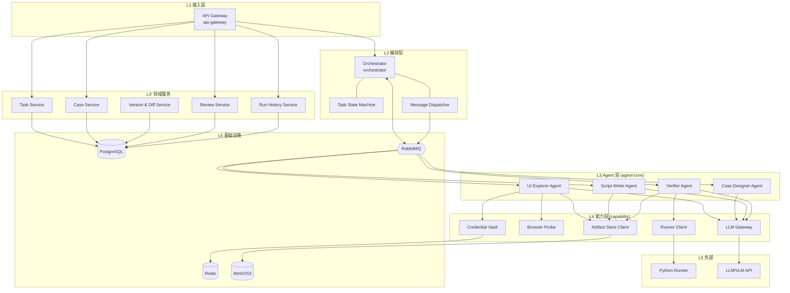
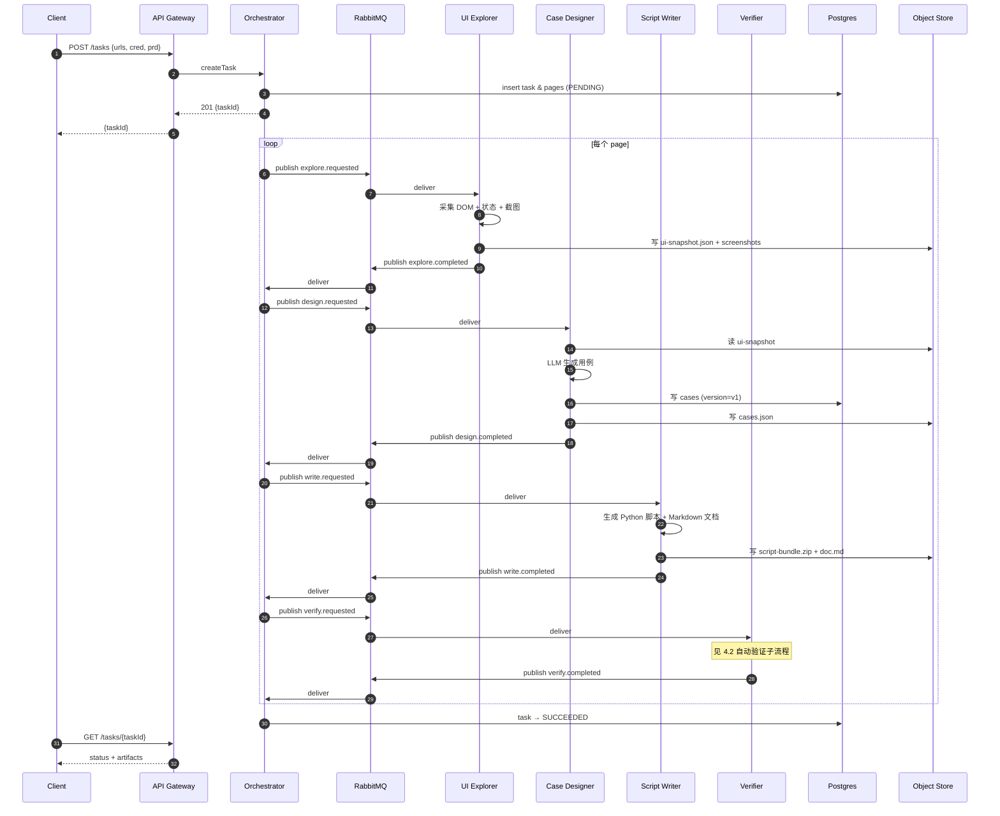
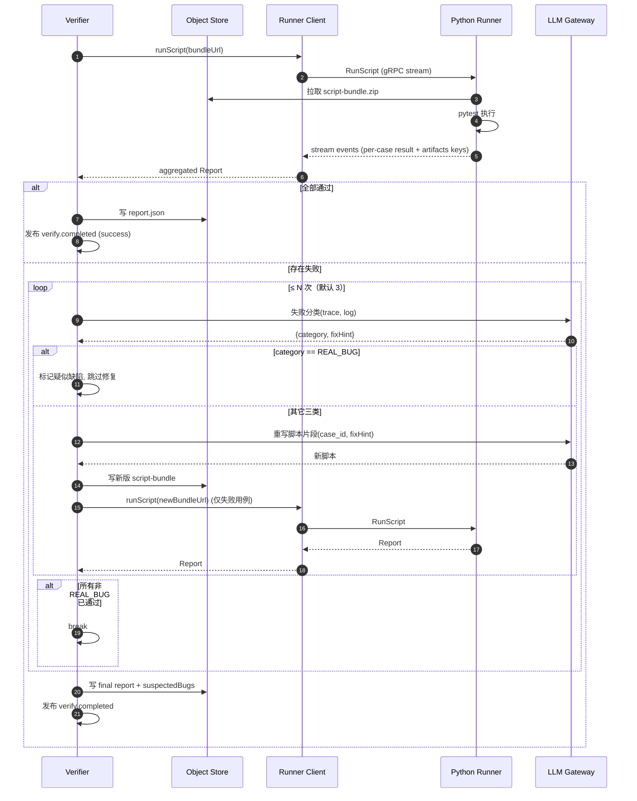
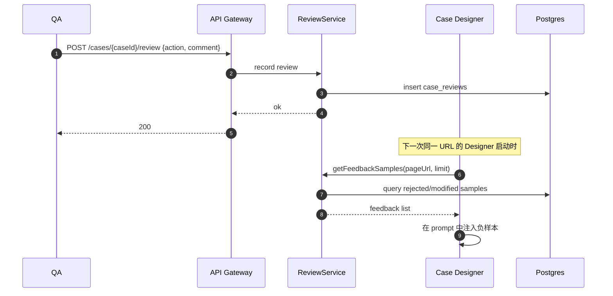
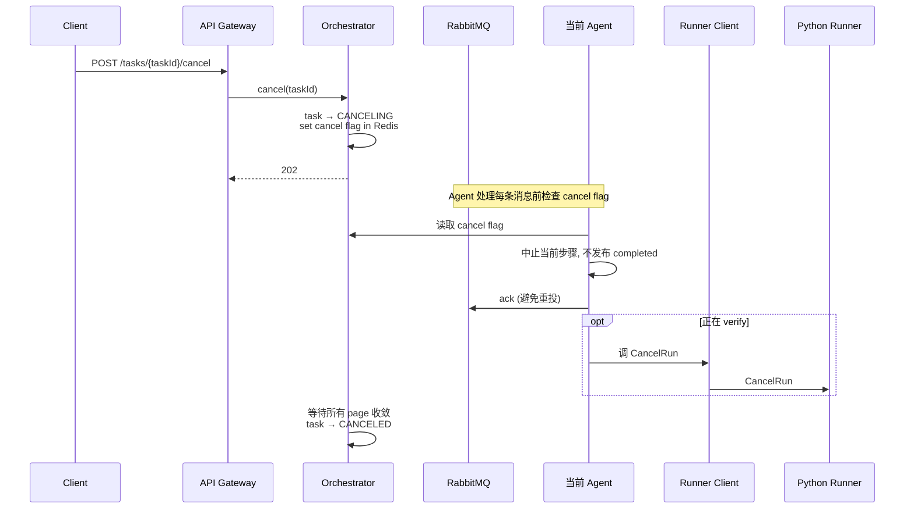
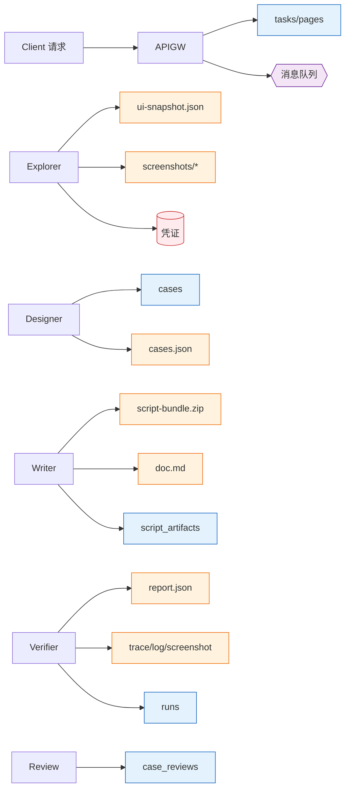

# UI 测试用例生成 Agent —— 概要设计文档（High-Level Design）

> 文档版本：v0.1
> 创建日期：2026-06-29
> 状态：草案
> 上游文档：[proposal.md](./proposal.md)（需求 v0.2）

---

## 0. 文档说明

### 0.1 目的与范围

本文档基于 `proposal.md` v0.2，给出系统的概要设计：识别**模块**、定义**模块职责**与**模块间关系**、明确**关键流程**与**部署形态**，作为后续详细设计（接口/数据/算法）的基线。

设计范围覆盖 **MVP + V1 + V2 能力预留**：

- MVP（阶段 1）必须实现的模块全部展开；
- V1（阶段 2）的能力（版本管理、人工闭环、执行历史等）作为独立模块设计，MVP 不实现但接口/数据模型预留；
- V2（阶段 3）的扩展点（多浏览器、视觉回归、用例平台对接等）以"扩展点"形式标注，本文档不展开。

### 0.2 关键设计决策摘要

| 决策项 | 取向 | 理由 |
| --- | --- | --- |
| 主服务部署形态 | Java 侧单仓多模块、单进程部署 | MVP 复杂度可控；模块边界以包/Spring Bean 隔离，未来可拆 |
| Agent 间协作 | **全消息驱动**（Agent 之间走 RabbitMQ） | 解耦、可重放、原生支持失败重试与限速 |
| 脚本传递 | 写入对象存储，Python Runner 拉取 | 解耦传输大小限制；同一脚本可被多次执行复用 |
| 多租户/鉴权 | **本期不考虑** | proposal.md 未要求；接口预留可扩展 |
| 时序图风格 | Mermaid | 可在 GitHub/常见 Markdown 渲染器中显示 |

### 0.3 术语表

| 术语 | 释义 |
| --- | --- |
| Task | 一次任务，包含若干 Page，对外是一个调度单元 |
| Page | 任务内的单个 URL 处理单元；并发与重试粒度 |
| Case | 一条测试用例；含文档表达 + 对应脚本片段 |
| Run | 一次脚本执行记录 |
| Artifact | 持久化产物：脚本、截图、trace、日志、文档等 |
| Agent | 系统中的独立职责单元，依靠消息编排串联 |

---

## 1. 总体架构

### 1.1 架构分层

系统按职责划分为 **6 个逻辑层**：

```
                          ┌─────────────────────────────┐
                          │  L1  接入层 (API Gateway)    │
                          └─────────────────────────────┘
                                       │
                          ┌─────────────────────────────┐
                          │  L2  编排层 (Orchestrator)   │
                          └─────────────────────────────┘
                                       │
                          ┌─────────────────────────────┐
                          │  L3  Agent 层（4 个子 Agent） │
                          └─────────────────────────────┘
                                       │
        ┌──────────────────┬───────────┴──────────┬──────────────────┐
        ▼                  ▼                      ▼                  ▼
┌───────────────┐ ┌────────────────┐  ┌──────────────────┐ ┌────────────────┐
│ L4 能力层     │ │ L4 能力层      │  │ L4 能力层        │ │ L4 能力层      │
│ LLM Gateway   │ │ Browser Probe  │  │ Script Runner    │ │ Artifact Store │
│ (LangChain4j) │ │ (PW for Java)  │  │ Client (gRPC)    │ │ Client         │
└───────────────┘ └────────────────┘  └──────────────────┘ └────────────────┘
                                       │
                          ┌─────────────────────────────┐
                          │  L5 外部服务层               │
                          │  Python Runner / LLM API     │
                          └─────────────────────────────┘
                                       │
                          ┌─────────────────────────────┐
                          │  L6 基础设施层               │
                          │  PG / Redis / MQ / 对象存储  │
                          └─────────────────────────────┘
```

各层职责：

| 层 | 职责 | 不做什么 |
| --- | --- | --- |
| L1 接入层 | HTTP 入口、参数校验、限流、统一响应封装 | 不持有业务状态、不直接调 LLM |
| L2 编排层 | 任务/页面状态机、消息分发、失败重试、产物归集 | 不直接采集页面、不直接生成用例 |
| L3 Agent 层 | UI 探查、用例生成、脚本生成、验证修复四个职责单元 | 不维护任务级状态、不直接持久化（通过领域服务） |
| L4 能力层 | 对 LLM、浏览器、外部 Runner、对象存储的统一封装 | 不感知业务语义 |
| L5 外部服务层 | Python Runner（脚本执行）、LLM/VLM 提供商 | — |
| L6 基础设施层 | 关系/缓存/对象/消息中间件 | — |

### 1.2 部署视图

```
┌──────────────────────────────────────────────────────────┐
│  Java 主服务  ui-test-agent.jar                          │
│  (Spring Boot 单进程，Gradle 多模块组装)                  │
│  ┌────────────┬────────────┬────────────┬────────────┐    │
│  │ api-gateway│orchestrator│ agent-core │ common-libs│    │
│  └────────────┴────────────┴────────────┴────────────┘    │
└──────────────────────────────────────────────────────────┘
            │  gRPC                       │  HTTP/SDK
            ▼                             ▼
┌────────────────────────┐    ┌──────────────────────────┐
│ Python Runner          │    │ 国内 LLM / VLM 提供商     │
│ FastAPI + Playwright   │    │ DeepSeek / Qwen-VL 等     │
│ (可水平扩容)            │    │                          │
└────────────────────────┘    └──────────────────────────┘
            │
            ▼  共同读写
┌──────────────────────────────────────────────────────────┐
│  基础设施（独立部署 / 由平台提供）                        │
│  PostgreSQL · Redis · RabbitMQ · MinIO(S3)               │
└──────────────────────────────────────────────────────────┘
```

部署单元：

| 单元 | 形态 | 扩缩 |
| --- | --- | --- |
| `ui-test-agent`（Java 主服务） | Docker 镜像，单进程 | 多副本水平扩展，无状态 |
| `python-runner` | Docker 镜像，FastAPI + Playwright | 多副本水平扩展，无状态 |
| PostgreSQL / Redis / RabbitMQ / MinIO | 平台提供或独立部署 | 按容量规划 |

---

## 2. 模块划分

### 2.1 模块总览图



### 2.2 模块清单

按 Gradle 子模块组织，单 JAR 部署。

| # | 模块（Gradle artifact） | 层 | 阶段 | 职责一句话 |
| --- | --- | --- | --- | --- |
| M1 | `api-gateway` | L1 | MVP | 暴露 REST API，参数校验，统一响应/错误 |
| M2 | `orchestrator` | L2 | MVP | 任务/页面状态机，消息分发，产物归集 |
| M3 | `agent-core` | L3 | MVP | 承载四个 Agent 的业务实现 |
| M3.1 | `agent-core::explorer` | L3 | MVP | UI Explorer Agent |
| M3.2 | `agent-core::designer` | L3 | MVP | Case Designer Agent |
| M3.3 | `agent-core::writer` | L3 | MVP | Script Writer Agent |
| M3.4 | `agent-core::verifier` | L3 | MVP | Verifier Agent |
| M4 | `domain-service` | L3' | MVP→V1 | 任务/用例/版本/审核/历史 5 个领域服务 |
| M5 | `capability` | L4 | MVP | 对外能力的统一封装 |
| M5.1 | `capability::llm-gateway` | L4 | MVP | LangChain4j 封装，多模型路由与重试 |
| M5.2 | `capability::browser-probe` | L4 | MVP | Playwright for Java 采集封装 |
| M5.3 | `capability::runner-client` | L4 | MVP | gRPC 客户端，调 Python Runner |
| M5.4 | `capability::artifact-store` | L4 | MVP | MinIO/S3 SDK 封装，生成预签名 URL |
| M5.5 | `capability::credential-vault` | L4 | MVP | 凭证加密、TTL 管理（Redis） |
| M6 | `common-proto` | — | MVP | gRPC 协议、跨模块 DTO |
| M7 | `common-libs` | — | MVP | 日志、异常、工具类 |
| MR | `python-runner`（独立仓库/独立镜像） | L5 | MVP | Python 脚本执行服务 |

### 2.3 V1/V2 能力的模块预留

| 能力 | 阶段 | 落点 | 备注 |
| --- | --- | --- | --- |
| 用例版本管理与变更检测 | V1 | M4 内新增 `VersionDiffService` | MVP 数据模型已含 `version` 字段，预留即可 |
| 人工审核闭环 | V1 | M4 内新增 `ReviewService` + Designer Agent 反馈通道 | Designer 增加"反馈样本"输入端口 |
| 执行历史与报告 | V1 | M4 内新增 `RunHistoryService` | Verifier 写历史，API 查询 |
| 多页面并发 | V1 | M2 编排层升级：页面级消息并发派发 | MVP 仅串行；MQ 队列承载并发 |
| 多浏览器/分辨率 | V2 | `python-runner` 参数化；M5.3 协议扩展 | 协议预留 `runtime_profile` 字段 |
| 视觉回归 | V2 | 新增 `VisualBaselineService`；Verifier 增加视觉断言步骤 | — |
| 用例平台对接（TestRail 等） | V2 | 新增 `integration` 模块，订阅 Case 事件 | 通过 MQ 事件外发 |
| Web 可视化界面 | V2 | 独立前端工程，复用现有 REST API | 不影响现有模块 |

---

## 3. 模块详述

### 3.1 M1 — API Gateway

**职责**
- HTTP 入口：路由、参数校验、统一响应封装、错误码映射、限流；
- 不持有业务逻辑：所有动作下沉到领域服务或 Orchestrator。

**对外接口（路由 + 职责，详细 Schema 见后续详细设计）**

| 方法 | 路径 | 阶段 | 职责 |
| --- | --- | --- | --- |
| POST | `/tasks` | MVP | 提交生成任务，返回 `task_id` |
| GET | `/tasks/{taskId}` | MVP | 查询任务状态、进度、产物索引 |
| GET | `/tasks/{taskId}/cases` | MVP | 获取本次任务生成的用例列表 |
| POST | `/tasks/{taskId}/cancel` | MVP | 取消任务 |
| POST | `/tasks/{taskId}/run` | V1 | 触发任务下脚本重跑 |
| GET | `/cases/{caseId}` | V1 | 查询单条用例详情（含历史版本） |
| POST | `/cases/{caseId}/review` | V1 | 人工标记（通过/修改/拒绝） |
| GET | `/cases/{caseId}/history` | V1 | 查询某用例的执行历史 |
| GET | `/cases/{caseId}/diff` | V1 | 查询用例版本间差异 |
| GET | `/actuator/**` | MVP | 健康、监控（仅内网） |

**依赖**：`Orchestrator`、`domain-service`、`common-libs`。
**不依赖**：Agent、外部 LLM、Python Runner。

---

### 3.2 M2 — Orchestrator

**职责**
- 维护 Task 与 Page 两级状态机；
- 接收 `POST /tasks` → 拆分页面 → 派发消息；
- 监听 Agent 产出的事件，根据状态机推进到下一步；
- 处理失败重试、超时、取消；
- 在任务完成时归集产物索引。

**状态机**

Task 状态：`PENDING → RUNNING → SUCCEEDED | FAILED | CANCELED`
Page 状态：`PENDING → EXPLORING → DESIGNING → WRITING → VERIFYING → DONE | FAILED`

**消息编排**

Agent 之间不直接互调，全部通过 RabbitMQ：

```
Page 状态推进 ⇔ 消息发送/消费
PENDING       →  send: explore.requested
EXPLORING     →  consume: explore.completed   →  send: design.requested
DESIGNING     →  consume: design.completed    →  send: write.requested
WRITING       →  consume: write.completed     →  send: verify.requested
VERIFYING     →  consume: verify.completed    →  Page → DONE
```

每个事件携带 `taskId / pageId / version`，幂等键由 Orchestrator 维护。

**依赖**：`RabbitMQ`、`domain-service`、`common-proto`。

---

### 3.3 M3 — Agent 层

四个 Agent 都是消息消费者 + 生产者。每个 Agent 是一个 Spring 组件，监听自己的请求队列，处理后发布完成事件。

#### 3.3.1 M3.1 UI Explorer Agent

**输入消息**：`explore.requested(taskId, pageId, url, credentialRef, prdRef)`
**输出消息**：`explore.completed(taskId, pageId, uiSnapshotRef, screenshotRefs[])`
**关键步骤**：
1. 通过 `credential-vault` 取凭证（如有）；
2. 调 `browser-probe` 打开页面、执行登录、保存 storage state；
3. DOM 抓取（元素树 + 选择器候选 + 属性 + 事件）；
4. 触发状态变化（hover/focus/空提交）记录差异；
5. 整页+关键区域截图；
6. 调 `llm-gateway`（VLM）做视觉补盲，结果与 DOM 合并；
7. 产出结构化 UI 描述 → 写 `artifact-store` → 发布完成事件。

**重试策略**：网络/页面级失败重试 2 次；登录失败立即报失败不重试。

#### 3.3.2 M3.2 Case Designer Agent

**输入消息**：`design.requested(taskId, pageId, uiSnapshotRef, prdRef, feedbackRef?)`
**输出消息**：`design.completed(taskId, pageId, casesRef, version)`
**关键步骤**：
1. 拉 UI 快照 + PRD（如有）+ 历史反馈样本（V1）；
2. 调 `llm-gateway` 生成功能用例（F2.1）；
3. 调 `llm-gateway` 生成异常/边界用例（F2.2）；
4. 推断优先级 P0/P1/P2（F2.3）；
5. 业务语义增强（F2.4）；
6. 落库（`CaseService`）+ 产出 cases.json 至 `artifact-store`；
7. （V1）若有上一版本，触发 `VersionDiffService` 写差异。

#### 3.3.3 M3.3 Script Writer Agent

**输入消息**：`write.requested(taskId, pageId, casesRef, uiSnapshotRef)`
**输出消息**：`write.completed(taskId, pageId, scriptBundleRef, docRef)`
**关键步骤**：
1. 拉用例 JSON + UI 快照；
2. 按"页面/用户旅程"组织为 pytest 文件结构；
3. 生成 Python 脚本（含 fixture、storage state 复用、断言）；
4. 在每个测试函数注释中嵌入 `case_id`（用于强一致校验）；
5. 生成 Markdown 文档（F3.1），每条用例附脚本位置 `file.py::test_name`；
6. 全部写入 `artifact-store`（按 `taskId/pageId/version/` 目录），返回 bundle 引用。

**校验**：本地静态检查（`py_compile` 等价，必要时由 Verifier 在执行前再确认）。

#### 3.3.4 M3.4 Verifier Agent

**输入消息**：`verify.requested(taskId, pageId, scriptBundleRef, casesRef, retryCount=0)`
**输出消息**：`verify.completed(taskId, pageId, reportRef, fixedScriptRef?, suspectedBugs[])`
**关键步骤**：
1. 调 `runner-client`，将脚本 bundle 引用下发给 Python Runner；
2. 收取报告（按用例粒度的成功/失败/log/trace/screenshot）；
3. 失败分类（F4.2）— 由 `llm-gateway` 辅助：选择器失效 / 等待时序 / 断言过严 / 真实 Bug；
4. 前三类调用 Script Writer 子流程或自身重写脚本，重新调 Runner（≤ N 次，默认 3）；
5. 第四类标记为疑似缺陷，附 trace/screenshot；
6. 写入 `RunHistoryService`（V1）+ `artifact-store`。

**为什么是 Verifier 内部循环而非回到 Orchestrator**：自修复是同一逻辑闭环，频繁打扰 Orchestrator 会让状态机臃肿；只要 Verifier 保证最大重试受控（N 次 + 总时长上限）。

---

### 3.4 M4 — 领域服务

| 服务 | 阶段 | 主表 | 职责 |
| --- | --- | --- | --- |
| TaskService | MVP | `tasks`, `pages` | Task/Page 的 CRUD、状态变更 |
| CaseService | MVP | `cases`, `script_artifacts` | 用例存取，版本号分配 |
| VersionDiffService | V1 | `cases` | 跨版本比较，输出新增/删除/修改 |
| ReviewService | V1 | `case_reviews` | 人工标记，反馈样本聚合给 Designer |
| RunHistoryService | V1 | `runs` | 执行历史写入与查询 |

所有领域服务对外暴露 Spring 接口（同进程调用），不直接走 MQ。

---

### 3.5 M5 — 能力层

| 能力 | 关键接口 | 备注 |
| --- | --- | --- |
| **LLM Gateway** | `complete(req)`、`vision(req)`、`embed(req)` | LangChain4j 封装；按模型类别路由（推理/代码/视觉）；统一限速、重试、token 计费埋点；预留 fallback 链 |
| **Browser Probe** | `explore(url, credential, opts) -> UiSnapshot` | 封装 Playwright for Java；浏览器实例池化；统一截图/状态触发动作集 |
| **Runner Client** | `runScript(bundleRef, opts) -> Report` | gRPC stub；超时、断线重连；按 `runId` 幂等 |
| **Artifact Store Client** | `put(key, bytes)`、`getUrl(key)`、`presignPut/Get` | MinIO/S3；预签名 URL 给 Python Runner 拉取脚本、回传日志 |
| **Credential Vault** | `store(taskId, plaintext) -> ref`、`load(ref)` | Redis 加密存储；TTL 与 Task 生命周期绑定 |

---

### 3.6 MR — Python Runner

**部署形态**：独立 Docker 镜像，FastAPI + Playwright Python；多副本无状态。

**接口（gRPC，proto 定义放 `common-proto`）**：

| RPC | 职责 |
| --- | --- |
| `RunScript(RunRequest) returns (stream RunEvent)` | 流式回传：开始/单用例完成/错误/总结 |
| `CancelRun(CancelRequest) returns (Ack)` | 取消正在进行的执行 |
| `HealthCheck` | 健康/容量上报 |

**脚本拉取方式**：Runner 从 `RunRequest.bundleUrl`（对象存储预签名 URL）下载 zip → 解压到临时目录 → `pytest` 执行 → 产物上传回对象存储 → 在事件流中回传产物的 key。

**为什么用 gRPC + 对象存储而不是把脚本随 RPC 传**：

- 脚本 bundle 可能含多个文件、截图、夹具，体积不可控；
- 同一 bundle 在自修复重试中只需上传一次，Runner 可缓存；
- 失败后产物（trace.zip 可能上 MB）也通过对象存储回传，gRPC 只走元数据，控制面与数据面解耦。

---

## 4. 关键流程

### 4.1 任务生成主流程



### 4.2 自动验证与自修复子流程



### 4.3 人工审核闭环（V1）



### 4.4 任务取消流程



---

## 5. 数据视图

### 5.1 数据流总图



### 5.2 持久化分区

| 存储 | 数据 | 生命周期 |
| --- | --- | --- |
| **PostgreSQL** | 任务、用例、版本、审核、运行历史等结构化数据 | 长期 |
| **MinIO/S3** | 截图、trace、脚本 bundle、文档、UI 快照、执行报告 | 按桶策略归档/清理（建议任务后 N 天冷存） |
| **Redis** | 登录凭证（加密 + TTL）、cancel flag、分布式锁、限流计数 | 短期（与任务生命周期挂钩） |
| **RabbitMQ** | 流转中的事件 | 短期（成功 ack 后消失） |

### 5.3 数据模型（沿用需求文档 §3.5，本文不再展开）

详细字段定义在详细设计阶段补完。

---

## 6. 横切关注点

### 6.1 配置管理

- Spring Boot `application.yml` + Profile（`dev`/`stg`/`prod`）；
- 敏感配置（LLM API Key、DB 密码）走环境变量或 Vault；
- 业务可调项集中：自修复次数、并发上限、单页面超时、模型选型 → 暴露为配置项（V1 起支持运行时刷新，MVP 重启生效）。

### 6.2 错误处理与重试

| 错误类别 | 处理 |
| --- | --- |
| 网络瞬时错误（HTTP/gRPC） | 能力层内部指数退避，最多 3 次 |
| LLM 调用失败 | LLM Gateway 内部 fallback 到备选模型；最终失败抛出业务异常 |
| Agent 处理失败 | Orchestrator 收到失败事件，page 标记 FAILED 但不影响其它 page |
| 消息消费异常 | 死信队列（DLQ）+ 告警 |
| 不可重试错误（参数非法、凭证错误） | 立即失败，状态 FAILED |

### 6.3 幂等性

- 所有 Agent 处理函数以 `(taskId, pageId, eventVersion)` 为幂等键，重复消息忽略；
- Verifier 重跑使用独立 `runId`，避免与历史 run 冲突；
- API Gateway 的写操作支持 `Idempotency-Key` 头（V1）。

### 6.4 安全

- 凭证：API 入参 → 立刻 AES-GCM 加密 → 写 Redis（TTL = task TTL）→ 任务结束清除；
- 对象存储：使用预签名 URL，最短可用时间；
- 日志：禁止打印凭证、PRD 全文、用户输入值；脱敏中间件统一处理；
- 暂不做多租户隔离与鉴权（按 §0.2 决策）。

### 6.5 可观测性

| 维度 | 工具 | 关键指标 |
| --- | --- | --- |
| 指标 | Micrometer → Prometheus | 任务吞吐、页面 P50/P95/P99 耗时、Agent 失败率、LLM token 用量、Runner 队列长度 |
| 日志 | Logback + 结构化 JSON → ELK | trace_id / task_id / page_id 贯穿 |
| 链路 | OpenTelemetry（V1） | 跨服务 trace：API → Orchestrator → Agent → Python Runner |
| 告警 | Grafana / Alertmanager | 失败率超阈值、DLQ 堆积、Runner 健康异常 |

### 6.6 性能与容量

- 单页面端到端目标耗时（V1 验收）：P95 ≤ 3 分钟；
- LLM 调用并发上限：通过 LLM Gateway 配置（避免被供应商限流）；
- Python Runner 并发上限：按 CPU 核数 × N，HPA 横向扩展；
- RabbitMQ 队列：每个 Agent 一队列，预取数 = 副本数 × 2。

---

## 7. 部署与运维

### 7.1 镜像与编排

| 镜像 | 基础 | 入口 |
| --- | --- | --- |
| `ui-test-agent` | `eclipse-temurin:17-jre` | `java -jar app.jar` |
| `python-runner` | `mcr.microsoft.com/playwright/python:v1.4x-jammy` | `uvicorn main:app` |

MVP 用 `docker-compose` 一键拉起：app + python-runner + postgres + redis + rabbitmq + minio。
V1 切 Kubernetes + Helm chart，每个组件独立 Deployment，Python Runner 启用 HPA。

### 7.2 配置与机密

- 配置文件挂载 `/config/application.yml`；
- 机密通过 K8s Secret 注入环境变量；
- LLM Key 支持多份并按 hash ring 分流（避免单 key 被限流）。

### 7.3 备份与容灾

| 数据 | 备份策略 |
| --- | --- |
| PostgreSQL | 每日全量 + WAL 归档；保留 30 天 |
| MinIO | 桶级版本化 + 跨区复制（V1）；冷数据 90 天后归档 |
| Redis | 仅运行态数据，不备份；丢失不影响正确性（凭证可由 QA 重传） |
| RabbitMQ | 持久化队列；集群部署（V1） |

### 7.4 升级与回滚

- Java 主服务：滚动发布；MQ 消费者优雅停机（处理完当前消息再退出）；
- Python Runner：滚动发布；正在运行的 RunScript 通过 `terminationGracePeriodSeconds` 等待完成；
- Schema 迁移：Flyway 管理；只允许向前兼容变更，破坏性变更需双发布周期。

---

## 8. 模块依赖与边界规则

为防止单仓多模块退化为大泥球，建立以下约束（由 ArchUnit 或 Konsist 在 CI 强制）：

1. **L1 不可直接调用 L3 Agent**：必须经过 L2 Orchestrator 或 L3' 领域服务；
2. **L3 Agent 之间禁止相互直调**：只通过 MQ；
3. **L3/L3' 不可直接持有 L6 客户端**：必须经 L4 能力层；
4. **L4 能力层不持有业务概念**：参数仅含数据/引用，不传 `Task` 等领域对象；
5. **`common-proto` 只放协议**：禁止包含业务逻辑；
6. **领域服务事务边界 = 单库事务**：跨服务调用不允许嵌套事务。

依赖方向图：

```
L1 ──→ L2 ──→ MQ ──→ L3
 │      │            │
 └──→ L3' ←──────────┘
        │
        ▼
       L4 ──→ L5 / L6
```

---

## 9. 风险与未决事项

### 9.1 风险（沿用并补充需求文档 §3.6）

| 新增风险 | 对策 |
| --- | --- |
| MQ 消息丢失导致任务僵死 | 持久化队列 + 消费者 ack；Orchestrator 定时巡检超时状态 |
| 对象存储不可用 → Agent 全链路阻塞 | 关键节点（snapshot/bundle 上传）失败可重试；超过阈值任务失败 |
| Python Runner OOM（重脚本 + Playwright 浏览器） | 单 pod 资源上限 + 用例级超时 + 容器 OOM 自动重启 |
| RabbitMQ 队列倾斜（某 Agent 慢） | 监控队列长度并独立扩容该 Agent；MVP 同进程内可调线程池 |
| 状态机与消息双写不一致 | Orchestrator 内 `事务消息` 模式：DB 提交后再发布 MQ；消息消费需校验状态 |

### 9.2 未决事项（需详细设计阶段确认）

1. 用例 JSON 的 Schema v1 定义；
2. Java ↔ Python Runner 的 protobuf v1 定义；
3. 失败分类的具体特征工程（trace 中哪些信号 → 哪类失败）；
4. PRD 输入的处理：纯文本 / PDF / Word？是否进 RAG？
5. 浏览器实例池策略：每 Agent 副本独占 N 个 / 全局池；
6. Spring AI vs LangChain4j 的最终取舍是否要再次评估（需求文档已选 LangChain4j，本设计沿用）。

---

*—— 文档结束 ——*
